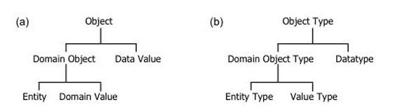
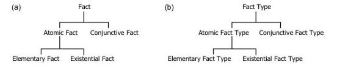
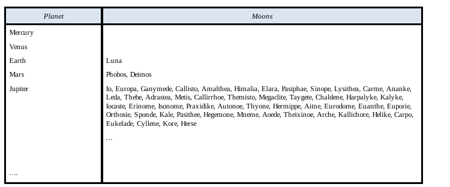
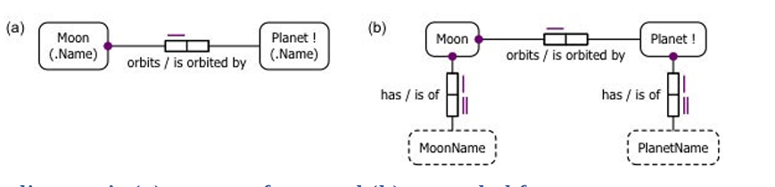
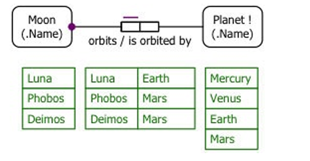
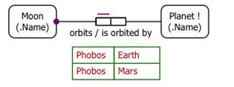
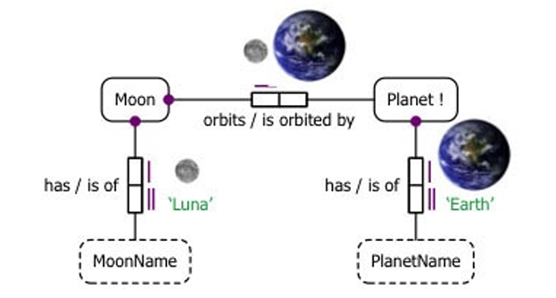

对象角色建模 (Object-Role Modeling, ORM) 是 *事实建模 (Fact-Based Modeling)* 或称 *面向事实建模 (Fact-Oriented Modeling)* 的一个典型范例。这是一种建模、查询和转换信息的通用方法，遵循以下原则：

- 所有值得关注的事实 (All facts of interest) 都通过 *无属性结构 (Attribute-Free Structures)*（称为 *事实类型 (Fact Types)*）在概念上表示。
- 概念模型 (Conceptual Models) 是基于所需信息的具体示例构建的。
- 概念模型使用 *受控自然语言 (Controlled Natural Language)* 进行表述。

事实建模起源于 1970 年代的欧洲，此后已发展成为一个相关方法族系 (Family of Related Approaches)，包括：

- 对象角色建模 (Object-Role Modeling, ORM)
- 认知增强自然语言信息分析方法 (Cognition enhanced Natural Language Information Analysis Method, CogNIAM)
- 完全沟通导向信息建模 (Fully Communication Oriented Information Modeling, FCO-IM)
- 开发本体论基础方法和应用方法 (Developing Ontology-Grounded Methods and Applications, DOGMA)

虽然所有这些方法都包含文本和图形语言, 以及建模和转换过程，但它们在细节上有所不同。有些将事实类型限制为中缀二元关系，有些比其他的支持更丰富的约束范围，并且不同的方法可能对相同的语义使用不同的语法。本书重点讨论对象角色建模 (ORM)，涵盖其建模过程 (Modeling Procedure) 和图形语言 (Graphical Language) 的主要方面，并使用其文本化的 *形式化 ORM 语言 (Formal ORM Language, FORML)* 作为表述 (Verbalization) 的受控自然语言。

在 ORM 中，*对象 (Object)* 指任何受关注的个体事物（不包括空值，空值可能体现在物理模型中, 用来表示数据缺失）。对象要么是领域对象，要么是数据值 。*领域对象(Domain Object)*是特定业务领域的一部分，比诸如整数或字符串之类的通用*数据值(data value)*承载更多的语义。领域对象要么是*实体 (Entity)*，要么是**领域值 (Domain Value)**。**领域值 (Domain Value)** 是一个**语义类型化的常量 (Semantically Typed Constant)**。例如，国家代码 ‘CH’ 是一个领域值，它由数据值 ‘CH’（一个纯字符串）表示，但其**类型 (Type)** (CountryCode) 承载了与业务领域相关的附加语义。例如，国家代码 ‘CH’ 基于拉丁语 (confoederatio helvetica，意思是瑞士联邦)，但字符串 ‘CH’ 本身不是。

*实体 (Entity)* 是一个**具体 (Concrete)** 或**抽象对象 (Abstract Object)**，通过将其与一个或多个领域对象相关联来识别 (Identified)。例如：实体瑞士 (Switzerland) 可以通过一个**确定性描述 (Definite Description)** (Definite Description) 来识别，如“拥有国家代码 ‘CH’ 的那个国家 (Country)”，或“拥有国家名 ‘Switzerland’ 的那个国家”。人 (People)、汽车 (Cars) 和国家 (Countries) 是具体或有形实体 (Concrete or Tangible Entities) 的典型例子。被识别为“拥有课程代码 ‘CS100’ 的那个课程 (Course)” 的大学课程是抽象或无形实体 (Abstract or Intangible Entity) 的一个例子。



**图 1.4 ORM 中的对象实例和对象类型**
 给定种类的所有可能对象的集合称为​**​对象类型 (Object Type)​**​。如图 1.4 所示，领域值类型 (Domain Value Types) 简称为​**​值类型 (Value Types)​**​，而数据值的类型称为​**​数据类型 (Data Type)​**​。在不会混淆的情况下，我们经常将 “domain value” 简称为 “value”。

在 ORM 中，一个**事实 (Fact)**（或称**事实实例 (Fact Instance)**）是一条被认为是真实（由相关业务社群认定）的**原子命题 (Atomic Proposition)** 或**合取命题 (Conjunctive Proposition)**。

- 一个**原子事实 (Atomic Fact)** 如果拆分涉及相同对象类型的两个或更多事实就会造成信息丢失，并且它要么是**基本事实 (Elementary Fact)**，要么是**存在事实 (Existential Fact)**。
- 一个**基本事实 (Elementary Fact)** 将一个**逻辑谓词 (Logical Predicate)** 应用到一个或多个对象上。例如，以下每个句子都表达了一个基本事实：名叫 ‘Barack Obama’ 的总统 (President) 是男性 (Male)；名叫 ‘Barack Obama’ 的总统出生于 (Was born in) 拥有国家代码 ‘US’ 的那个国家 (Country)。
- **逻辑谓词 (Logical Predicates)** 由**谓词表述 (Predicate Readings)**（如 “… is male”, “… was born in …”）表示，其中包含其对象的**占位符 (Placeholders)**（此处显示为省略号 “…”）。基本事实句子将**对象项 (Object Terms)** (Object Terms) 放入谓词占位符中。在上面的例子中，识别性的对象项是确定性描述 (Definite Descriptions)。
- 一个**存在事实 (Existential Fact)** 简单地断言 (Asserts) 单个对象的存在。例如，以下句子表达了一个存在事实：存在一个拥有国家代码 ‘US’ 的国家。
- 一个**合取事实 (Conjunctive Fact)** 是两个或多个原子事实的**逻辑合取 (Logical Conjunction)**。例如，以下句子表达了一个合取事实：名叫 ‘Barack Obama’ 的总统是男性 (is male) 并且 (and) 出生于拥有国家代码 ‘US’ 的国家。给定种类的所有可能事实的集合称为一个**事实类型 (Fact Type)**。事实和事实类型的整体分类如图 1.5 所示。



**图 1.5 ORM 中的事实实例和事实类型​****​
 在 ORM 中，一个​**​原子事实类型 (Atomic Fact Type)​**​ 对应于一个非空的、包含一个或多个​**​类型化谓词 (Typed Predicates)​**​ (Typed Predicates) 的集合，这些谓词使得同一种事实能够被表达。例如，以下每个句子表达了相同的事实：
 (1)   名叫 ‘Barack Obama’ 的总统出生于拥有国家代码 ‘US’ 的那个国家。
 (2)   拥有国家代码 ‘US’ 的那个国家是名叫 ‘Barack Obama’ 的总统的出生国 (Birth Country)。
 句子(1)使用了事实类型表述 (Fact Type Reading) “President was born in Country”。这里的对象类型是总统(President)和国家(Country)，谓词表述是“was born in”。句子(2)使用了事实类型表述 “Country is the birth country of President”，以及谓词表述 “is the birth country of”。ORM 允许你为同一个事实类型提供任意数量的表述。

虽然在外部层允许合取事实 (Conjunctive Facts)，但 ORM 概念模型要求所有事实必须是原子事实 (Atomic)。这确保了所有事实都以最简单的方式建模，有助于阐明预期的语义并避免使用空值 (Nulls)。稍后使用各种映射过程将事实分组到逻辑层、物理层和外部层使用的各种结构中。

在概念层，应用各种约束 (Constraints) 来限制原子事实类型的可能的或允许的数据实例集 (Permitted Populations)。

- 例如，应将以下约束（用 FORML 表达）添加到上述出生事实类型中：**每个总统至多出生于一个国家 (Each President was born in at most one Country)**。
- 如果一个事实类型可以从其他事实类型**派生 (Derived)** 出来，则应该将其标记为**派生的 (Derived)**，并提供**派生规则 (Derivation Rule)**。例如，如果模型中包含事实类型 `总统(President) 死于( died on ) 日期(Date)`，则事实类型 `总统(President) 已死(is dead)` 的实例可以使用此派生规则派生出来：**对于每位总统，该总统已死，如果该总统死于某个日期 (For each President, that President is dead if that President died on some Date)**。

如图 1.6 所示，ORM 概念模式 (Conceptual Schema) 包含原子事实类型、约束和派生规则。概念模型还包括一个数据实例集（一组原子事实）。不同的数据实例集可用于不同的目的。


 ​**​图 1.6 ORM 中的概念模型组件​**​
 原子事实告知我们有关对象所扮演的​**​角色 (Roles)​**​ 的信息。

- 在上面的出生事实示例中，总统扮演了出生在某个国家的角色 (Role)，而国家扮演了作为总统出生国的角色 (Role)。
- 因此，**角色 (Role)** 或**事实角色 (Fact Role)** 是对象在某个事实中所扮演的部分。如果需要，可以为角色赋予**角色名称 (Role Names)**（例如 “native”, “birthCountry”）。
- 对象角色建模之所以如此命名，是因为它用对象扮演角色的视角来看待世界。

一个事实类型中的角色数量称为其**元数 (Arity)**。ORM 允许元数大于零的任何事实类型。

- 一个**一元事实类型 (Unary Fact Type)** 恰好有一个角色（例如 `人吸烟(Person smokes)`; `人已死(Person is dead)`)。这使得一元事实的表达方式比给布尔属性 (Boolean Attribute)（例如 `Person.isSmoker`）赋真值要自然得多。
- 一个**二元事实类型 (Binary Fact Type)** 有两个角色（例如 `人出生于国家(Person was born in Country)`; `人喜欢人(Person likes Person)`）。
- 一个**三元事实类型 (Ternary Fact Type)** 有三个角色（例如 `人为国家参加运动项目(Person played Sport for Country)`）。
- 一个**四元事实类型 (Quaternary Fact Type)** 有四个角色（例如 `商店在某月份以某数量销售了产品(Store in Month sold Product in Quantity)`），依此类推。

相比基于属性 (Attribute-Based) 的模型（如实体-关系 (Entity-Relationship, ER) 建模、统一建模语言 (Unified Modeling Language, UML) 和关系数据库 (Relational Database, RDB) 模型中使用的模型），**无属性模型 (Attribute-Free Models)** 具有以下优势：

- 它们**促进语义稳定性 (Promote Semantic Stability)**
- 它们**便于通过样本数据实例集进行验证 (Facilitate Validation by Sample Populations)**
- 它们**便于通过自然表述进行验证 (Facilitate Validation by Natural Verbalization)**

语义稳定的模型能更轻松地适应变化。例如，假设一个 ORM 模型包含事实类型 `人有人称谓(Person has PersonTitle)` 和 `人有性别(Person has Gender)`，现在我们决定记录哪些人称谓限制用于哪些性别（例如，称谓“Mrs”限制用于女性性别）。为此，我们添加事实类型 `人称谓限制用于性别(PersonTitle is restricted to Gender)`，模型的其余部分保持不变[3]。

而一个基于属性的模型通常会将称谓和性别事实建模为人的属性（例如 `Person.title` 和 `Person.gender`）。由于属性本身不能有属性或参与其他关系，因此现在除了重建现有结构（例如，通过将称谓属性替换为指向一个人称谓(PersonTitle) 实体类型或类的关系）之外，没有其他方法可以建模称谓-性别限制。如果模型先前已有实例填充，并且已经在其上制定了查询，那么这些也都需要进行更改。

这种无属性模型的**更高语义稳定性 (Greater Semantic Stability)** 不仅为事实建模所享有，也为将所有事实建模为关系的其他方法所享有，例如：

- 业务词汇和业务规则语义 (Semantics of Business Vocabulary and Business Rules, SBVR) 方法 (Approach)
- 语义网语言 (Semantic Web Languages)，如 **Web 本体语言 (Web Ontology Language, OWL)**
- 面向对象系统模型 (Object-Oriented Systems Model, OSM)

具有受控自然语言的无属性模型便于通过 **表述 (Verbalization)** 和 **数据实例集 (Population)** 进行**模型验证 (Model Validation)**。模型验证应该是建模者 (Modeler) 和最理解业务领域的业务领域专家 (Business Domain Expert) 之间的协作过程。所有事实、事实类型、约束和派生规则都可以用领域专家（他们可能不是最终用于物理实现的软件系统的专家）容易理解的、明确无误的语言自然地表述出来。

举个简单的例子，假设一个信息系统需要记录我们的太阳系行星及其卫星。表 1.1 显示了该系统需要输出的一份报告的摘录。为节省输入，我省略了木星之外三个已知行星的细节。在撰写本文时，木星有 50 颗已确认的卫星（如所列），土星有 53 颗，天王星有 27 颗，海王星有 13 颗。大多数外行星还有许多其他疑似但尚未确认的卫星，所以这些数量可能会随着时间的推移而增加。你可以在  在线查看最新细节。表 1.1 对我们的月球使用了拉丁名称“Luna”。它也被称为“Earth’s moon”或有点误导性地称为“the moon”。
 ​**​表 1.1 一份关于我们太阳系行星及其卫星的样本报告摘录​**



由于此报告处于**外部层 (External Level)**，数据可以按任何所需格式显示。为了为此报告开发 ORM 模型，我们首先将所需各类信息的至少一个示例作为原子事实表述出来。

- 例如，我们可以将“行星 (Planet)”列中的“水星 (Mercury)”条目表述为以下存在事实：**存在一颗名为‘水星(Mercury)’的行星 (There exists a Planet named ‘Mercury’)**。如第 2 章所讨论，对存在关系 (Existential Relationships) 应用约束以确保识别 (Identification)，在本例中允许确定性描述（如“名为‘Mercury’的行星 (the Planet named ‘Mercury’)”）作为实体的识别项 (Identifying Terms)。
- 同样，我们可以将“卫星 (Moons)”列中的“Luna”条目表述为存在事实：**存在一颗名为‘Luna’的卫星 (There exists a Moon named ‘Luna’)**。
- 我们可以将“地球 (Earth)”和“Luna”放在表格同一行的各自列中这一位置关系，表述为基本事实：**名为‘地球’的行星被名为‘Luna’的卫星环绕 (The Planet named ‘Earth’ is orbited by the Moon named ‘Luna’)**, 或等效地表述为：**名为‘Luna’的卫星环绕名为‘地球’的行星 (The Moon named ‘Luna’ orbits the Planet named ‘Earth’)**。表中的所有数据都可以表述为这三种事实之一。

使用 ORM 的**图形符号 (Graphical Notation)**，我们可以显示这三个原子事实类型的概念模式图 (Conceptual Schema Diagram)，包括相关约束，如图 1.7 所示。

- 实体类型卫星 (Moon) 和行星 (Planet) 被描绘为命名的、圆角矩形。一颗卫星或行星通过与一个单一的值（在本例中是其名称）的关系来识别。每个这样的关系都是一个**简单引用模式 (Simple Reference Scheme)** (Simple Reference Scheme) 的示例，涉及一个单一的存在事实类型。
- 单一值引用单个实体的方式 (Manner) 称为**引用模式 (Reference Mode)**。为简洁起见，简单引用方案可以用**缩写形式 (Abbreviated Form)** 显示，将引用模式列在实体类型名称下方的括号中，如图 1.7(a) 所示。例如，`Moon(.Name)` 使用引用模式 .Name 来缩写一个显式的存在事实类型（也称为**引用类型 (Reference Type)**），其**正向表述 (Forward Reading)** 为“卫星有卫星名称 (Moon has MoonName)”，**反向表述 (Inverse Reading)** 为“卫星名称是某个卫星的 (MoonName is of Moon)”，并被约束为**识别性的 (Identifying)**（参见后文），如图 1.7(b) 所示。

值类型卫星名称 (MoonName) 和行星名称 (PlanetName) 被描绘为具有虚线边框的、命名的圆角矩形。



 ​**​图 1.7 ORM 模式图：(a) 紧凑形式, 和 (b) 展开形式​**​

- **事实类型角色 (Fact Type Roles)** 被描绘为**角色框 (Role Boxes)**，通过线段连接到承载该角色的对象类型。谓词被描绘为一个有序的角色框集合，旁边有一个谓词表述。

- 图 1.7(a) 中显式显示的二元事实类型具有正向和反向谓词表述 (Forward and Inverse Predicate Readings)，“orbits” 和 “is orbited by”，用斜杠 “/” 分隔。

  - 从左到右阅读，我们得到事实类型表述“卫星环绕行星 (Moon orbits Planet)”。
  - 从右到左阅读，我们得到事实类型表述“行星被卫星环绕 (Planet is orbited by Moon)”。

- 图 1.7(a) 中连接到卫星角色框的大紫色点描绘了一个

  强制角色约束 (Mandatory Role Constraint)

  ，表示该角色必须由卫星对象类型数据实例集中的每个实例扮演。

  - 在 FORML 中，这个约束表述为：**每颗卫星环绕某个行星 (Each Moon orbits some Planet)**。[4]

- 同样地，图 1.7(b) 中显示在存在事实类型上的强制角色约束表述为：**每颗卫星有某个卫星名称 (Each Moon has some MoonName)** 和 **每颗行星有某个行星名称 (Each Planet has some PlanetName)**。在本书中，我们约定：对象类型名称以大写字母开头，并且在表述中，像 “Each” 和 “some” 这样的逻辑词如果包含在表述的一部分中，则显示为粗体。

出于验证目的，为事实类型提供**样本数据实例集 (Sample Population)**。在图 1.8 中，样本数据实例集显示在模式图下方的**事实表 (Fact Tables)** 中，每个对象类型或事实类型角色对应一列。例如，三个事实表第一行的条目断言了以下事实：

- 存在一颗名为‘Luna’的卫星。
- 名为‘Luna’的卫星环绕名为‘地球(Earth)’的行星。
- 存在一颗名为‘水星(Mercury)’的行星。
  你可以看到样本数据实例集满足了在环绕事实类型上的强制角色约束。



 ​**​图 1.8 一个具有满足数据集的 ORM 模型​**​

- 断言一颗给定卫星环绕一颗给定行星的基本事实实际上暗示了该卫星和行星的存在。
- 由于每颗卫星环绕某个行星，因此无需显式断言卫星的存在事实，因为这些将通过它们的环绕事实推断出来。
- 然而，有些行星（水星 Mercury 和金星 Venus）没有卫星，所以需要单独的存在事实来断言它们的存在。
- 由于有些行星不一定被卫星环绕，行星在事实类型 `卫星环绕行星 (Moon orbits Planet)` 中的角色绝不能标记为强制的，因此在图 1.8 中，其角色连接器上没有强制角色点。
- 基本事实类型 (Elementary Fact Type) 中的一个角色称为**基本角色 (Elementary Role)**。如果模型中包含了行星的另一个基本角色（例如，如果还必须记录每颗卫星的质量），则在其环绕角色上缺乏强制角色标记就足以表明该环绕角色是**可选的 (Optional)**。然而，在图 1.8 的模型中，行星没有其他基本角色。
- ORM 假设每个对象类型的数据实例集中的每个实例至少扮演一个基本角色，除非该对象类型被声明为**独立的 (Independent)**。这个假设简化了许多建模任务以及 ORM 的底层形式理论。例如，它避免了随着模型的增长而需要显式更新许多角色的强制/可选状态的需要。
- 在 ORM 的图形符号中，在对象类型名称后附加感叹号 “!” 表示该对象类型是独立的（即，它可以包括不扮演任何基本角色而存在的实例），如图 1.8 中的行星所示。
- 卫星所承载角色上的紫色条描绘了一个**简单唯一性约束 (Simple Uniqueness Constraint)** (Simple Uniqueness Constraint)，它在 FORML 中表述如下：**每颗卫星至多环绕一颗行星 (Each Moon orbits at most one Planet)**。因此，受唯一性约束 (Uniquely Constrained) 的角色对应的事实列中的每个条目在那里至多出现一次。
- 在此事实类型中行星角色上缺乏唯一性约束，在 FORML 中表述如下：**可能某个行星被多颗卫星环绕 (It is possible that some Planet is orbited by more than one Moon)**。如果你查看样本数据实例集，可以看到它满足这种约束模式 (Constraint Pattern)。

为了解释说明，图 1.9 为展开的模式图填充了每个事实类型的一个实例，这次直接使用它们的图像来描绘卫星和行星。

- 从概念上讲，基本事实实例声明了一颗特定的、实际的卫星环绕一颗特定的、实际的行星。

- 存在事实实例将这些实体与其名称（‘Luna’ 和 ‘Earth’）关联起来。

- 存在事实类型顶部角色上的唯一性约束表述为：**每颗卫星至多有一个卫星名称 (Each Moon has at most one MoonName)** 和 **每颗行星至多有一个行星名称 (Each Planet has at most one PlanetName)**。

- 存在事实类型底部角色上的唯一性约束表述为：**每个卫星名称至多属于一颗卫星 (Each MoonName is of at most one Moon)** 和 **每个行星名称至多属于一颗行星 (Each PlanetName is of at most one Planet)**。

- 卫星名称和行星名称角色上的**双重唯一性条 (Double Uniqueness Bar)** 表示这些唯一性约束支撑了卫星和行星的**首选引用模式 (Preferred Reference Scheme)**。

- 在 

  ```
  卫星有卫星名称 (Moon has MoonName)
  ```

   关系上的

  强制 (Mandatory)

   和

  唯一性约束 (Uniqueness Constraints)

   的组合确保了：

  - 每颗卫星恰好有一个卫星名称。
  - 该名称至多指代一颗卫星。

- 这种强制的一对一关系 (Mandatory, One-to-One Relationship) 称为**单射 (Injection)** (Injection)，并为实体类型提供了最简单的引用模式。

同样地，从行星到行星名称的单射关系 (Injective Relationship) 提供了其首选引用模式。​



**​图 1.9 概念化基本事实和存在事实​**​

用受控自然语言表述约束 (Verbalizing Constraints) 并通过样本数据实例集说明它们，使得领域专家 (Domain Experts) 验证模型 (Validate the Model) 变得容易得多。如果某个约束仍然存疑，一个好的双重检查方法是提供一个**反例 (Counterexample)**（一个违反约束的示例）并询问这类情况是否可能。

图 1.10 显示了一个数据实例集，其中一颗卫星环绕两颗行星，从而为约束 “每颗卫星至多环绕一颗行星” 提供了一个反例。如果领域专家说这类情况不可能发生，那么该约束就得到确认。当然，如果领域专家确认这类情况可能发生，那么该约束就是错误的，应该被移除（例如，假设论域扩展到包括太阳系外行星，并且发现一颗确实环绕不止一颗行星的卫星）。



 ​**​图 1.10 一个具有违反唯一性约束的反例的 ORM 模型​**​

将所有事实建模为事实类型的实例，能够通过填充事实表以简单、统一的方式提供满足的示例和反例 (Counterexamples)。对于基于属性的结构来说，这样做要麻烦得多。表述也自然得多，特别是在 ORM 中，因为 ORM 支持**混合中缀谓词 (Mixfix Predicates)**（任何元数的）。

- 混合中缀谓词表述 (Mixfix Predicate Readings) 允许它们的对象占位符混合放置在任意位置。
- 例如，三元事实类型 `国家出口产品到国家 (Country exports Product to Country)` 使用混合中缀谓词表述 “… exports … to …”。
- 除了允许更自然的表达，并且支持一元和 n 元事实之外，混合中缀谓词 (Mixfix Predicates) 还能处理任何自然语言的句子。
  - 在英语中，二元事实通常使用**中缀谓词 (Infix Predicate)** (Infix Predicates) 表达，符合主语-动词-宾语结构（Subject-Verb-Object Structure）（例如，句子 “Luna orbits Earth” 使用中缀谓词表述 “… orbits …”）。
  - 然而，日语句子通常使用主语-宾语-动词结构（Subject-Object-Verb Structure）。例如，我们的月球环绕地球的事实在日语中表述为 “Tsuki wa chikyū o shūkai suru”，它使用了混合中缀谓词表述 “… wa … o shūkai suru”。这里，Tsuki（月球[5]）是主语 (Subject)，chikyū（地球）是语法宾语 (Grammatical Object)，shūkai suru”（goes around, does）是动词 (Verb)，而 wa 和 o 是附加到句子主题（这里的主语）和语法宾语上的**助词 (Particles)** (Particles)。

ORM **极具表现力的图形符号 (Richly Expressive Graphical Notation)** 使建模者能够轻松地可视化复杂约束（例如**排斥对约束 (Pair-Exclusion Constraints)** (Pair-Exclusion Constraints)、**外部频率约束 (External Frequency Constraints)** (External Frequency Constraints)、**环约束 (Ring Constraints)** (Ring Constraints)），这些约束无法在工业版 ER 的图形符号或 UML 类图 (Class Diagrams) 中捕获。其无属性的本质也通过明确显示对象类型如何承载角色 (Host Roles)，更好地揭示了语义连接 (Semantic Connections)。