## 目录 Contents

[TOC]


## 引言 Foreword 

 Serge Valera
 高级软件工程师，系统、软件与在轨演示部
 欧洲航天局

开发与运行航天系统涉及复杂的活动，需要众多合作伙伴参与，这些合作伙伴在地域和时间上都是分散的。这就要求所有相关合作伙伴之间进行高效且有效的信息交换。多年来开发集中式信息系统的经验揭示了此类开发的复杂性，其结果往往是产生不充分、低效的产品，无法满足所有需求。同样，多年来通过复用（和改造）“专有”系统来构建分布式信息系统的经验也表明，这种方法常常导致最终数据交换中的语义丢失。

这些缺陷的根源始终如一：客户难以在委托开发所需产品之前，全面且恰当地明确其需求并验证由此产生的系统需求规格说明。

当今工业界使用的大多数信息建模方法都是技术驱动的，而非充分关注客户的需求。这些方法侧重于根据所需的存储和访问性能，以数据项的形式来构建信息，对语义的重视程度很低。

本书介绍的**对象角色建模（Object-Role Modeling, ORM）** 方法从客户的视角（即“做什么”（WHAT））来处理信息建模。该方法专注于将所有利益相关者的信息需求捕获到一个概念模型中，该模型可以表达为系统需求规格说明（即合同语言），目的是让这些利益相关者在任何合同协议达成之前对其进行验证。

ORM 是一种**基于事实的建模（Fact Based Modelling, FBM）** 方法，其中所有事实都被建模为关系（一元、二元、三元等）。事实如何被分组到结构中是一个实现问题，超出了客户的关注范围。这为任何合同业务带来了更高的**语义稳定性（semantic stability）**。通过以**原子事实（atomic facts）** 的形式捕获信息，ORM 以最简单的方式表达了信息需求。

自 20 世纪 80 年代末在欧空局（ESA）工作以来，我一直在寻找一种能够全面且正式地明确“做什么”（即应用 ISO TR9007 的**概念化（Conceptualization）** 和 **100% 原则（100% Principle）**）的方法。我在 90 年代初发现了基于事实的建模方法，并成功使用 ORM 来开发内部信息系统，以及为验证和确认相关工业开发的充分性而对情况进行概念化。

2006 年，我结识了 Terry 以及 FBM 研究界的其他同仁，并自此一直与他们合作。如今，在欧洲航天局，我们拥有将任何信息系统作为独立产品进行开发的技术。在这些系统的规格说明中使用 FBM 和 ORM，降低了因未能理解利益相关者需求而导致昂贵开发的风险。

在欧洲航天业务领域，更广泛地说，在所有涉及众多工业界和机构合作伙伴的大型产品开发中，所缺失的是解决**互操作性（interoperability）** 的恰当手段，即在语义层面解决互操作性的手段。

得益于 Terry 持续分享知识、将其多年研究积累的专业知识传授给欧空局的意愿，我们现在正面临软件业务的新发展，即“从产品建模到企业建模”、“从语义建模到语义互操作性”。

实现**语义互操作性（semantic interoperability）** 需要对所涉及的产品进行**语义建模（semantic modelling）**，使用诸如 FBM/ORM 这样的建模方法来全面且精确地捕获相关语义。这就引出了如何最好地培训工业界从业者掌握 ORM 的问题。

先前出版的关于 ORM 的书籍，要么深入且广泛地涵盖了多种信息系统建模方法，包括对 ORM 逻辑基础的正式讨论，要么专注于特定 ORM 建模工具的使用。相比之下，Terry 的新书主要面向从业者，对 ORM 的关键方面进行了简洁明了的介绍，并解释了如何在实践中使用它来开发信息系统。

将学术知识转移到工业界一直是一项艰巨的任务。工业界需要评估研究技术的成熟度、开发可操作解决方案所需的工业工作量，以及最终解决方案对业务产生积极影响的价值。这种**技术成熟度（Technology Readiness Level, TRL）** 评估正在欧洲航天业务领域持续进行。Terry 的新书将在此评估中发挥重要作用。结合书中讨论的 NORMA 免费工具，它为新手提供了一种途径，通过应用 ORM 方法论（例如用于开发新信息系统，或用于促进验证现有或在开发系统充分性的过程）来发现 ORM 概念建模的优势，从而降低整体维护成本。

Terry 的书编写精良且足够详细，能让新手理解如何用 ORM 对信息需求进行概念化。NORMA 工具的可用性、ORM 图形符号以及 FORML 中的自动化表述功能，为轻松学习和快速利用 ORM 作为一种捕获业务领域语义的手段提供了条件。

对于那些使用关系数据库的人来说，NORMA 从 ORM 到关系模型的自动映射功能，有助于人们认识到在下降到实现层面之前，先以一种自然的方式对语义进行建模的好处。

我强烈推荐本书给任何希望其信息建模师能清晰记录其需求的客户。我也强烈推荐本书给任何概念建模师，他们希望使用一种基于逻辑的正式手段来捕获其利益相关者的需求，并在考虑对某些特定功能进行原型设计之前，就验证业务领域规格说明的充分性。

## 序言 Preface 

本书提供了使用**对象角色建模（Object-Role Modeling, ORM）**方法进行数据建模的实用介绍。ORM 是一种**基于事实的建模（fact-based modeling）**方法，它简单地以在关系中扮演角色的**对象（objects）**来表达任何业务领域的信息需求。所有感兴趣的事实都被视为**无属性结构（attribute-free structures）**（称为**事实类型（fact types）**）的实例，其中关系可以是一元的（例如，`Person smokes`）、二元的（例如，`Person was born on Date`）、三元的（例如，`Customer bought Product on Date`）或更高元的。

与**实体关系建模（Entity Relationship Modeling, ER）**或**统一建模语言（Unified Modeling Language, UML）**中使用的基于属性的结构相比，事实类型便于自然表达，易于填充示例以进行验证，并且具有更高的**语义稳定性（semantic stability）**。

所有相关的事实、约束和派生规则都用**受控自然语言（controlled natural language）**句子表达，这些句子对于被建模业务领域的用户来说是易于理解的。这使得 ORM 数据模型可以由不熟悉 ORM 图形符号的业务领域专家进行验证。对于数据建模者而言，ORM 的图形符号比工业界 ER 或 UML 类图所能表达的约束范围要广泛得多，从而允许对底层语义进行丰富的可视化。

我写这本书主要是面向数据建模从业者，无论是新手还是经验丰富者。尽管 ORM 在逻辑学上有着坚实的理论基础，但我避免了使用任何符号逻辑表示法，而是尝试用易于理解的语言涵盖 ORM 方法的基础知识。本书的大部分内容详细描述了如何设计 ORM 模型，并通过简单示例说明设计过程的每一步。

每一章都以一个实用的实验结束，讨论如何使用免费的 **NORMA 工具**来输入 ORM 模型，并用它自动生成模型的表述（verbalizations）并将其映射到关系数据库。

- **第 1 章** 概述了信息建模（特别是 ORM）。它讨论了信息可以在不同层面表示，并重点介绍了 ORM 方法的显著特征，使用一个简单示例来说明这些思想。然后概述了 ORM 的**概念模式设计流程（Conceptual Schema Design Procedure, CSDP）**，并简要介绍了基于事实建模工具的历史。
- **第 2 章** 重点介绍 CSDP 的前五个步骤。在这些步骤中，第一步是最重要的，因为在这里我们用自然语言表述所需信息的示例，并在需要时重新表述它们，使每个事实都是原子的（atomic）。本书封面上的图片象征着这种方法，我们根据原子事实来分析被建模世界所需的信息。在 CSDP 的步骤 2 中，我们绘制事实类型并通过填充样本数据进行检查。CSDP 的步骤 3 包括检查应合并的实体类型以及可以通过算术派生规则从其他事实派生的事实。在 CSDP 的步骤 4 和 5 中，我们添加**唯一性约束（uniqueness constraints）**和**强制角色约束（mandatory role constraints）**，并对事实类型的长度以及是否可以通过逻辑派生规则派生某些事实进行检查。
- **第 3 章** 重点介绍 CSDP 的步骤 6。在这里，我们添加任何相关的**值约束（value constraints）**、**集合比较约束（set comparison constraints）**（子集、相等或排斥）和**子类型化（subtyping）**。
- **第 4 章** 涵盖 CSDP 的步骤 7。在这里，我们添加任何相关的**频率约束（frequency constraint）**、**环约束（ring constraints）**、**值比较约束（value-comparison constraints）**、**基数约束（cardinality constraints）**、**道义约束（deontic constraints）**和**文本约束（textual constraints）**，并以一些最终检查结束。
- **附录 A** 简要概述了将 ORM 模式映射到关系数据库模式的流程的某些方面，然后展示了如何使用 NORMA 工具从 ORM 模型生成代码，特别侧重于 SQL 的生成。
- **附录 B** 提供了本书讨论的 ORM 图形符号摘要。
- **附录 C** 最后提供了一些可能感兴趣的进一步资源建议，包括一些书籍、期刊论文、软件和网站。

虽然全书使用美式拼写（US spelling），但我采用了澳大利亚标点符号风格来处理引用的表达式和其他少数情况。例如，逗号或句点出现在右引号之后，而不是紧贴在其之前；逗号出现在诸如“e.g.”或“i.e.”等缩略语之前而非之后。此外，对于其结尾字母与完整单词一致的缩写词不加句点（例如，使用“Mr”而不是“Mr.”）。

**致谢**

我衷心感谢 Serge Valera，他非常友好地为本书撰写了序言，并对部分章节进行了校对和建议。我也感谢 Matt Curland 数千小时的编程工作，他与我一起持续推动着 NORMA 工具的演进。我还要感谢 Sjir Nijssen 和 Eckhard Falkenberg 在基于事实建模方面所做的开创性工作，是他们首次向我介绍了该方法的 NIAM 变体。最后，我感谢 Steve Hoberman 邀请我为从业者撰写 ORM 的简短介绍，并监督出版过程。

## 对象角色建模概述 Overview of Object-Role Modeling 

### 信息建模 Information Modeling

本书讨论如何为一个业务领域建模其 *信息需求（Information Requirements）*，使得建模结果既能被业务用户轻松理解，又能自动生成用于存储该信息的数据库结构。通常情况下, 信息模型会被称为数据模型，但信息和数据是两者不同的术语, 信息为添加了*语义（Semantics）*或 *意义（Meaning）*的数据的数据，而数据本身可能只是一堆数字或者是字符串。如图1.1(a)所示的表格片段中的数据。作为未被解读的语法(syntax)，这可以被赋予无限多种可能的含义。例如，x 和 y 可能代表分别装有10支和100支铅笔的盒子，或者代表长度为10厘米和100厘米的线段，又或者代表为10公斤和100公斤机器人的质量，等等。

图1.1(b)提供的信息稍微多一点。我们大多数人会认为这表达了数字100是10的平方这一事实，尽管原则上它可能意味着其他意思（例如，编号为10的建筑物位于100号广场）。即使说其所含的是数字100是10的平方，如果没有约定所使用的记数法，其语义仍然是模糊的。在默认情况下，100和10常被假定为阿拉伯十进制记数法，但示例数据同样符合二进制记数法（二进制数字“10”和“100”表示由十进制数字“2”和“4”所表示的数字）同样也是语义模糊。当然，如果我们在数据中添加第二行数据对（5, 25），就将排除二进制的解释。

现在考虑图1.1(c)。您会如何用语言表述此示例所传达的事实？大多数人会说：“患者编号（PatientNumber）为10的患者，其体温为100度”。这依赖于对相关业务领域的背景知识（例如，知道患者是通过患者编号来标识的，并且该温度是患者的体温）。

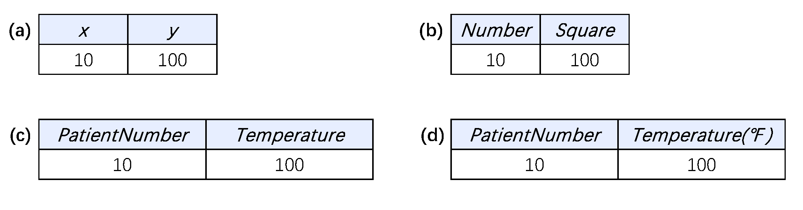

**图1.1 这些示例旨在传达什么信息？What information is intended to be conveyed by these examples?**

当然，除非我们知道所使用的温标，否则这仍然是模糊的，这很可能指华氏温标，因为100摄氏度和100开尔文对于活着的人来说都太极端了。为了避免测量量可能引起的误解，相关计量单位应始终明确说明，如图1.1(d)所示。因此，预期的事实可以表述为：“患者编号（PatientNumber）为10的患者体温（Temperature）为100华氏度（Fahrenheit Degrees）”。简而言之，需要熟悉业务领域的人为数据添加语义，从而将数据转化为信息。

较好的信息建模关键在于，采用业务用户容易理解的概念来表达预期的语义。满足此要求的信息模型称为*概念模型（Conceptual Model）*[^1]。“*论域（Universe of Discourse，UoD）*”这个术语用于指代业务领域（Business Domain）中我们希望讨论的那些方面。因此，概念模型是用自然的、人类易于理解的概念来表达相关论域的模型。当模型完整时，它包含了所有与之相关的结构细节（Structural Details）。任何模型（无论是否概念模型）的结构（Structure）都称为*模式（Schema）*，因此概念模型(Concetpual model)的结构是概念模式（Conceptual Schema）。符合该模式的一组对象实例（Object Instances）和事实实例（Fact Instances），构成该模式的一个实例集（Population）。如图1.2(a)所示，模型（Model）是模式及其数据实例集的组合，其中数据实例集可以是空的[^2]。

在开发信息系统（Information System）时，信息可以在不同的层面（Levels）进行处理，如图1.2(b)所示：

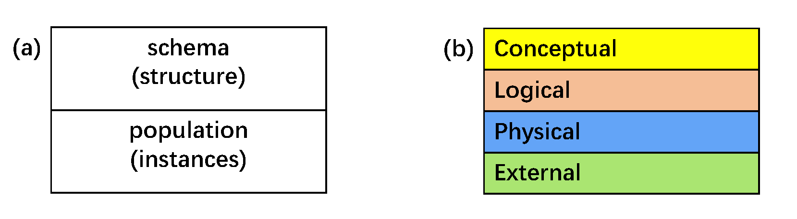

**图 1.2 信息系统开发中涉及的模型与层面 Models and levels involved in information systems development**

- ***概念层（Conceptual Level）***：在这里，模型（Models）和查询（Queries）以人类自然理解的概念（例如，实体（Entities）、属性（Attributes）、关系（Relationships））来构建。
- ***逻辑层（Logical Level）***：在这里，信息模型和查询是根据逻辑数据模型（Logical Data Model）（例如，关系模型（Relational）、面向对象模型（Object-Oriented）、层次模型（Hierarchic）、演绎模型（Deductive））所支持的数据与操作的抽象结构来构建。例如，关系模型将事实聚类到表（Tables）中，并使用主键（Primary Key）和外键约束（Foreign Key Declarations）等对它们进行约束。
- ***物理层（Physical Level）***：在这里，选择一个特定的数据库管理系统（Database Management System, DBMS）和/或编程语言来实现逻辑层的结构，并进行性能调优。例如，关系模型可以在 SQL Server、DB2 或 Oracle 中实现为数据库模型（Database Model）。物理层结构也可以被划分为瞬态（内存中）结构（Transient/In-Memory Structures）和持久化（在数据库中）结构（Persistent (Database) Structures），以及它们之间的映射。
- ***外部层（External Level）***：在这里，人类通过基于表单的（Forms-Based）或图形用户界面(GUI)直接与系统交互。不同的用户组可能被分配不同的对底层数据的访问权限，用户可以通过界面输入查询，查询结果则显示在屏幕上或出现在打印报告中。

在实践中，并非所有信息系统都使用所有四个层面进行开发，并且某些结构可能跨越多个层面（例如，UML 中的类模型（Class Models in UML）可以说是结合了概念层、逻辑层和物理层的方面）。此外，技术用户（Technical Users）可能会直接在物理层与系统交互。然而，理想情况下，建模应首先在概念层完成，与业务领域专家在那里进行验证，然后通过将概念结构自动或至少半自动地转换到其他层面来进行*前向工程（Forward Engineering）*。这个整体过程称为模型驱动工程（Model-Driven Engineering）。

*对象角色建模（Object-Role Modeling, ORM）*（本书的重点）是一种模型驱动工程方法，它从用户熟悉的任何外部形式呈现的所需信息和查询的典型示例开始，然后在概念层用简单事实对这些示例进行*表述（Verbalized）*，这些简单事实用*受控自然语言（Controlled Natural Language）*表达——一种受限制且明确无歧义的自然语言变体，其语义容易被人类理解，同时也是形式化的，因此它可以用来将结构自动映射到较低层面进行实现，如图1.3所示。作为这一整体过程的一部分，本书讨论了如何创建 ORM 模型以及如何将它们映射到关系数据库模型。ORM 模型也可以映射到其他类型的模型（对象导向型、演绎型等）。

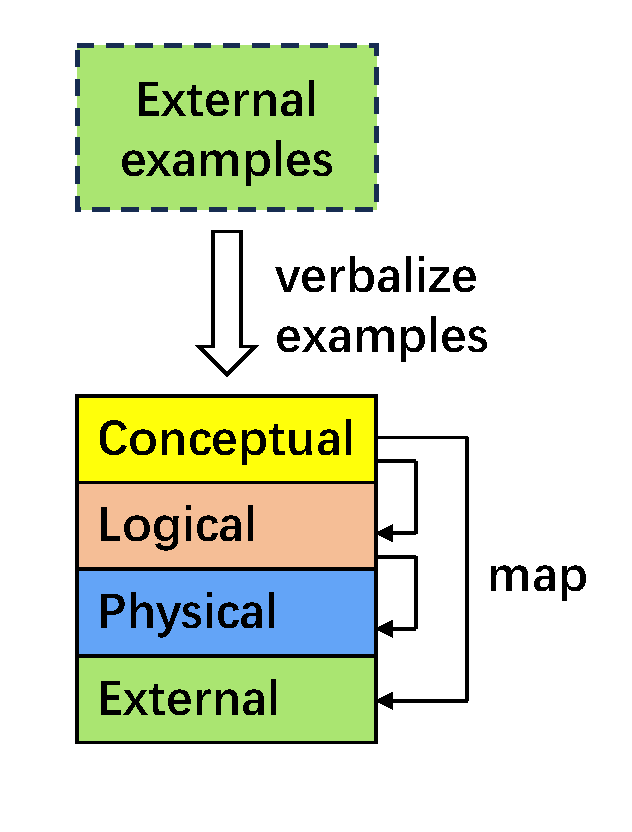

**图1.3 基于示例表述的模型驱动工程 (Model-Driven Engineering Based on Verbalization of Examples)**

[^1]: 有些作者使用“概念模型”一词时，含义较为宽泛，仅涵盖业务领域的主要方面
[^2]: 有些作者将“模型(model)”一词视为“模式(schema)”的同义词，但我们认为模型(model)也可以包含数据集（人口数据）。

### 基于事实的建模 Fact-Based Modeling

对象角色建模 (Object-Role Modeling, ORM) 是 *事实建模 (Fact-Based Modeling)* 或称 *面向事实建模 (Fact-Oriented Modeling)* 的一个典型范例。这是一种建模、查询和转换信息的通用方法，遵循以下原则：

- 所有值得关注的事实 (All facts of interest) 都通过 *无属性结构 (Attribute-Free Structures)*（称为 *事实类型 (Fact Types)*）在概念上表示。
- 概念模型 (Conceptual Models) 是基于所需信息的具体示例构建的。
- 概念模型使用 *受控自然语言 (Controlled Natural Language)* 进行表述。

事实建模起源于 1970 年代的欧洲，此后已发展成为一个相关方法族系 (Family of Related Approaches)，包括：

- 对象角色建模 (Object-Role Modeling, ORM)
- 认知增强自然语言信息分析方法 (Cognition enhanced Natural Language Information Analysis Method, CogNIAM)
- 完全沟通导向信息建模 (Fully Communication Oriented Information Modeling, FCO-IM)
- 开发本体论基础方法和应用方法 (Developing Ontology-Grounded Methods and Applications, DOGMA)

虽然所有这些方法都包含文本和图形语言, 以及建模和转换过程，但它们在细节上有所不同。有些将事实类型限制为中缀二元关系，有些比其他的支持更丰富的约束范围，并且不同的方法可能对相同的语义使用不同的语法。本书重点讨论对象角色建模 (ORM)，涵盖其建模过程 (Modeling Procedure) 和图形语言 (Graphical Language) 的主要方面，并使用其文本化的 *形式化 ORM 语言 (Formal ORM Language, FORML)* 作为表述 (Verbalization) 的受控自然语言。

在 ORM 中，*对象 (Object)* 指任何受关注的个体事物（不包括空值，空值可能体现在物理模型中, 用来表示数据缺失）。对象要么是领域对象，要么是数据值 。*领域对象(Domain Object)*是特定业务领域的一部分，比诸如整数或字符串之类的通用*数据值(data value)*承载更多的语义。领域对象要么是*实体 (Entity)*，要么是**领域值 (Domain Value)**。**领域值 (Domain Value)** 是一个**语义类型化的常量 (Semantically Typed Constant)**。例如，国家代码 ‘CH’ 是一个领域值，它由数据值 ‘CH’（一个纯字符串）表示，但其**类型 (Type)** (CountryCode) 承载了与业务领域相关的附加语义。例如，国家代码 ‘CH’ 基于拉丁语 (confoederatio helvetica，意思是瑞士联邦)，但字符串 ‘CH’ 本身不是。

*实体 (Entity)* 是一个**具体 (Concrete)** 或**抽象对象 (Abstract Object)**，通过将其与一个或多个领域对象相关联来识别 (Identified)。例如：实体瑞士 (Switzerland) 可以通过一个**确定性描述 (Definite Description)** (Definite Description) 来识别，如“拥有国家代码 ‘CH’ 的那个国家 (Country)”，或“拥有国家名 ‘Switzerland’ 的那个国家”。人 (People)、汽车 (Cars) 和国家 (Countries) 是具体或有形实体 (Concrete or Tangible Entities) 的典型例子。被识别为“拥有课程代码 ‘CS100’ 的那个课程 (Course)” 的大学课程是抽象或无形实体 (Abstract or Intangible Entity) 的一个例子。

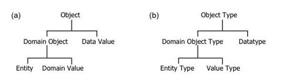

**图 1.4 ORM 中的对象实例和对象类型**
 给定种类的所有可能对象的集合称为​**​对象类型 (Object Type)​**​。如图 1.4 所示，领域值类型 (Domain Value Types) 简称为​**​值类型 (Value Types)​**​，而数据值的类型称为​**​数据类型 (Data Type)​**​。在不会混淆的情况下，我们经常将 “domain value” 简称为 “value”。

在 ORM 中，一个**事实 (Fact)**（或称**事实实例 (Fact Instance)**）是一条被认为是真实（由相关业务社群认定）的**原子命题 (Atomic Proposition)** 或**合取命题 (Conjunctive Proposition)**。

- 一个**原子事实 (Atomic Fact)** 如果拆分涉及相同对象类型的两个或更多事实就会造成信息丢失，并且它要么是**基本事实 (Elementary Fact)**，要么是**存在事实 (Existential Fact)**。
- 一个**基本事实 (Elementary Fact)** 将一个**逻辑谓词 (Logical Predicate)** 应用到一个或多个对象上。例如，以下每个句子都表达了一个基本事实：名叫 ‘Barack Obama’ 的总统 (President) 是男性 (Male)；名叫 ‘Barack Obama’ 的总统出生于 (Was born in) 拥有国家代码 ‘US’ 的那个国家 (Country)。
- **逻辑谓词 (Logical Predicates)** 由**谓词表述 (Predicate Readings)**（如 “… is male”, “… was born in …”）表示，其中包含其对象的**占位符 (Placeholders)**（此处显示为省略号 “…”）。基本事实句子将**对象项 (Object Terms)** (Object Terms) 放入谓词占位符中。在上面的例子中，识别性的对象项是确定性描述 (Definite Descriptions)。
- 一个**存在事实 (Existential Fact)** 简单地断言 (Asserts) 单个对象的存在。例如，以下句子表达了一个存在事实：存在一个拥有国家代码 ‘US’ 的国家。
- 一个**合取事实 (Conjunctive Fact)** 是两个或多个原子事实的**逻辑合取 (Logical Conjunction)**。例如，以下句子表达了一个合取事实：名叫 ‘Barack Obama’ 的总统是男性 (is male) 并且 (and) 出生于拥有国家代码 ‘US’ 的国家。给定种类的所有可能事实的集合称为一个**事实类型 (Fact Type)**。事实和事实类型的整体分类如图 1.5 所示。

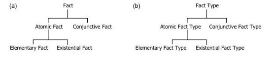

**图 1.5 ORM 中的事实实例和事实类型​****​
 在 ORM 中，一个​**​原子事实类型 (Atomic Fact Type)​**​ 对应于一个非空的、包含一个或多个​**​类型化谓词 (Typed Predicates)​**​ (Typed Predicates) 的集合，这些谓词使得同一种事实能够被表达。例如，以下每个句子表达了相同的事实：
 (1)   名叫 ‘Barack Obama’ 的总统出生于拥有国家代码 ‘US’ 的那个国家。
 (2)   拥有国家代码 ‘US’ 的那个国家是名叫 ‘Barack Obama’ 的总统的出生国 (Birth Country)。
 句子(1)使用了事实类型表述 (Fact Type Reading) “President was born in Country”。这里的对象类型是总统(President)和国家(Country)，谓词表述是“was born in”。句子(2)使用了事实类型表述 “Country is the birth country of President”，以及谓词表述 “is the birth country of”。ORM 允许你为同一个事实类型提供任意数量的表述。

虽然在外部层允许合取事实 (Conjunctive Facts)，但 ORM 概念模型要求所有事实必须是原子事实 (Atomic)。这确保了所有事实都以最简单的方式建模，有助于阐明预期的语义并避免使用空值 (Nulls)。稍后使用各种映射过程将事实分组到逻辑层、物理层和外部层使用的各种结构中。

在概念层，应用各种约束 (Constraints) 来限制原子事实类型的可能的或允许的数据实例集 (Permitted Populations)。

- 例如，应将以下约束（用 FORML 表达）添加到上述出生事实类型中：**每个总统至多出生于一个国家 (Each President was born in at most one Country)**。
- 如果一个事实类型可以从其他事实类型**派生 (Derived)** 出来，则应该将其标记为**派生的 (Derived)**，并提供**派生规则 (Derivation Rule)**。例如，如果模型中包含事实类型 `总统(President) 死于( died on ) 日期(Date)`，则事实类型 `总统(President) 已死(is dead)` 的实例可以使用此派生规则派生出来：**对于每位总统，该总统已死，如果该总统死于某个日期 (For each President, that President is dead if that President died on some Date)**。

如图 1.6 所示，ORM 概念模式 (Conceptual Schema) 包含原子事实类型、约束和派生规则。概念模型还包括一个数据实例集（一组原子事实）。不同的数据实例集可用于不同的目的。


 ​**​图 1.6 ORM 中的概念模型组件​**​
 原子事实告知我们有关对象所扮演的​**​角色 (Roles)​**​ 的信息。

- 在上面的出生事实示例中，总统扮演了出生在某个国家的角色 (Role)，而国家扮演了作为总统出生国的角色 (Role)。
- 因此，**角色 (Role)** 或**事实角色 (Fact Role)** 是对象在某个事实中所扮演的部分。如果需要，可以为角色赋予**角色名称 (Role Names)**（例如 “native”, “birthCountry”）。
- 对象角色建模之所以如此命名，是因为它用对象扮演角色的视角来看待世界。

一个事实类型中的角色数量称为其**元数 (Arity)**。ORM 允许元数大于零的任何事实类型。

- 一个**一元事实类型 (Unary Fact Type)** 恰好有一个角色（例如 `人吸烟(Person smokes)`; `人已死(Person is dead)`)。这使得一元事实的表达方式比给布尔属性 (Boolean Attribute)（例如 `Person.isSmoker`）赋真值要自然得多。
- 一个**二元事实类型 (Binary Fact Type)** 有两个角色（例如 `人出生于国家(Person was born in Country)`; `人喜欢人(Person likes Person)`）。
- 一个**三元事实类型 (Ternary Fact Type)** 有三个角色（例如 `人为国家参加运动项目(Person played Sport for Country)`）。
- 一个**四元事实类型 (Quaternary Fact Type)** 有四个角色（例如 `商店在某月份以某数量销售了产品(Store in Month sold Product in Quantity)`），依此类推。

相比基于属性 (Attribute-Based) 的模型（如实体-关系 (Entity-Relationship, ER) 建模、统一建模语言 (Unified Modeling Language, UML) 和关系数据库 (Relational Database, RDB) 模型中使用的模型），**无属性模型 (Attribute-Free Models)** 具有以下优势：

- 它们**促进语义稳定性 (Promote Semantic Stability)**
- 它们**便于通过样本数据实例集进行验证 (Facilitate Validation by Sample Populations)**
- 它们**便于通过自然表述进行验证 (Facilitate Validation by Natural Verbalization)**

语义稳定的模型能更轻松地适应变化。例如，假设一个 ORM 模型包含事实类型 `人有人称谓(Person has PersonTitle)` 和 `人有性别(Person has Gender)`，现在我们决定记录哪些人称谓限制用于哪些性别（例如，称谓“Mrs”限制用于女性性别）。为此，我们添加事实类型 `人称谓限制用于性别(PersonTitle is restricted to Gender)`，模型的其余部分保持不变[3]。

而一个基于属性的模型通常会将称谓和性别事实建模为人的属性（例如 `Person.title` 和 `Person.gender`）。由于属性本身不能有属性或参与其他关系，因此现在除了重建现有结构（例如，通过将称谓属性替换为指向一个人称谓(PersonTitle) 实体类型或类的关系）之外，没有其他方法可以建模称谓-性别限制。如果模型先前已有实例填充，并且已经在其上制定了查询，那么这些也都需要进行更改。

这种无属性模型的**更高语义稳定性 (Greater Semantic Stability)** 不仅为事实建模所享有，也为将所有事实建模为关系的其他方法所享有，例如：

- 业务词汇和业务规则语义 (Semantics of Business Vocabulary and Business Rules, SBVR) 方法 (Approach)
- 语义网语言 (Semantic Web Languages)，如 **Web 本体语言 (Web Ontology Language, OWL)**
- 面向对象系统模型 (Object-Oriented Systems Model, OSM)

具有受控自然语言的无属性模型便于通过 **表述 (Verbalization)** 和 **数据实例集 (Population)** 进行**模型验证 (Model Validation)**。模型验证应该是建模者 (Modeler) 和最理解业务领域的业务领域专家 (Business Domain Expert) 之间的协作过程。所有事实、事实类型、约束和派生规则都可以用领域专家（他们可能不是最终用于物理实现的软件系统的专家）容易理解的、明确无误的语言自然地表述出来。

举个简单的例子，假设一个信息系统需要记录我们的太阳系行星及其卫星。表 1.1 显示了该系统需要输出的一份报告的摘录。为节省输入，我省略了木星之外三个已知行星的细节。在撰写本文时，木星有 50 颗已确认的卫星（如所列），土星有 53 颗，天王星有 27 颗，海王星有 13 颗。大多数外行星还有许多其他疑似但尚未确认的卫星，所以这些数量可能会随着时间的推移而增加。你可以在  在线查看最新细节。表 1.1 对我们的月球使用了拉丁名称“Luna”。它也被称为“Earth’s moon”或有点误导性地称为“the moon”。
 ​**​表 1.1 一份关于我们太阳系行星及其卫星的样本报告摘录​**

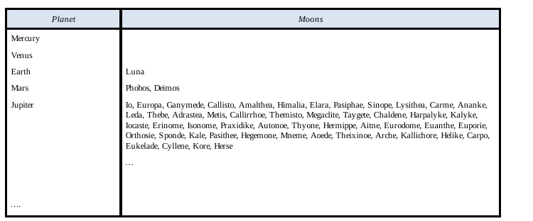

由于此报告处于**外部层 (External Level)**，数据可以按任何所需格式显示。为了为此报告开发 ORM 模型，我们首先将所需各类信息的至少一个示例作为原子事实表述出来。

- 例如，我们可以将“行星 (Planet)”列中的“水星 (Mercury)”条目表述为以下存在事实：**存在一颗名为‘水星(Mercury)’的行星 (There exists a Planet named ‘Mercury’)**。如第 2 章所讨论，对存在关系 (Existential Relationships) 应用约束以确保识别 (Identification)，在本例中允许确定性描述（如“名为‘Mercury’的行星 (the Planet named ‘Mercury’)”）作为实体的识别项 (Identifying Terms)。
- 同样，我们可以将“卫星 (Moons)”列中的“Luna”条目表述为存在事实：**存在一颗名为‘Luna’的卫星 (There exists a Moon named ‘Luna’)**。
- 我们可以将“地球 (Earth)”和“Luna”放在表格同一行的各自列中这一位置关系，表述为基本事实：**名为‘地球’的行星被名为‘Luna’的卫星环绕 (The Planet named ‘Earth’ is orbited by the Moon named ‘Luna’)**, 或等效地表述为：**名为‘Luna’的卫星环绕名为‘地球’的行星 (The Moon named ‘Luna’ orbits the Planet named ‘Earth’)**。表中的所有数据都可以表述为这三种事实之一。

使用 ORM 的**图形符号 (Graphical Notation)**，我们可以显示这三个原子事实类型的概念模式图 (Conceptual Schema Diagram)，包括相关约束，如图 1.7 所示。

- 实体类型卫星 (Moon) 和行星 (Planet) 被描绘为命名的、圆角矩形。一颗卫星或行星通过与一个单一的值（在本例中是其名称）的关系来识别。每个这样的关系都是一个**简单引用模式 (Simple Reference Scheme)** (Simple Reference Scheme) 的示例，涉及一个单一的存在事实类型。
- 单一值引用单个实体的方式 (Manner) 称为**引用模式 (Reference Mode)**。为简洁起见，简单引用方案可以用**缩写形式 (Abbreviated Form)** 显示，将引用模式列在实体类型名称下方的括号中，如图 1.7(a) 所示。例如，`Moon(.Name)` 使用引用模式 .Name 来缩写一个显式的存在事实类型（也称为**引用类型 (Reference Type)**），其**正向表述 (Forward Reading)** 为“卫星有卫星名称 (Moon has MoonName)”，**反向表述 (Inverse Reading)** 为“卫星名称是某个卫星的 (MoonName is of Moon)”，并被约束为**识别性的 (Identifying)**（参见后文），如图 1.7(b) 所示。

值类型卫星名称 (MoonName) 和行星名称 (PlanetName) 被描绘为具有虚线边框的、命名的圆角矩形。

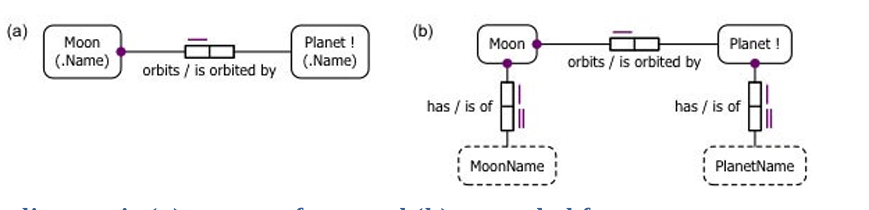

 ​**​图 1.7 ORM 模式图：(a) 紧凑形式, 和 (b) 展开形式​**​

- **事实类型角色 (Fact Type Roles)** 被描绘为**角色框 (Role Boxes)**，通过线段连接到承载该角色的对象类型。谓词被描绘为一个有序的角色框集合，旁边有一个谓词表述。

- 图 1.7(a) 中显式显示的二元事实类型具有正向和反向谓词表述 (Forward and Inverse Predicate Readings)，“orbits” 和 “is orbited by”，用斜杠 “/” 分隔。

  - 从左到右阅读，我们得到事实类型表述“卫星环绕行星 (Moon orbits Planet)”。
  - 从右到左阅读，我们得到事实类型表述“行星被卫星环绕 (Planet is orbited by Moon)”。

- 图 1.7(a) 中连接到卫星角色框的大紫色点描绘了一个

  强制角色约束 (Mandatory Role Constraint)

  ，表示该角色必须由卫星对象类型数据实例集中的每个实例扮演。

  - 在 FORML 中，这个约束表述为：**每颗卫星环绕某个行星 (Each Moon orbits some Planet)**。[4]

- 同样地，图 1.7(b) 中显示在存在事实类型上的强制角色约束表述为：**每颗卫星有某个卫星名称 (Each Moon has some MoonName)** 和 **每颗行星有某个行星名称 (Each Planet has some PlanetName)**。在本书中，我们约定：对象类型名称以大写字母开头，并且在表述中，像 “Each” 和 “some” 这样的逻辑词如果包含在表述的一部分中，则显示为粗体。

出于验证目的，为事实类型提供**样本数据实例集 (Sample Population)**。在图 1.8 中，样本数据实例集显示在模式图下方的**事实表 (Fact Tables)** 中，每个对象类型或事实类型角色对应一列。例如，三个事实表第一行的条目断言了以下事实：

- 存在一颗名为‘Luna’的卫星。
- 名为‘Luna’的卫星环绕名为‘地球(Earth)’的行星。
- 存在一颗名为‘水星(Mercury)’的行星。
  你可以看到样本数据实例集满足了在环绕事实类型上的强制角色约束。

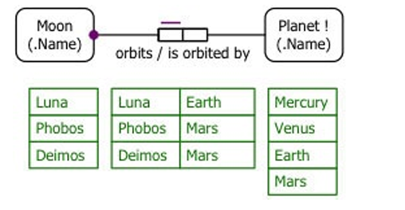

 ​**​图 1.8 一个具有满足数据集的 ORM 模型​**​

- 断言一颗给定卫星环绕一颗给定行星的基本事实实际上暗示了该卫星和行星的存在。
- 由于每颗卫星环绕某个行星，因此无需显式断言卫星的存在事实，因为这些将通过它们的环绕事实推断出来。
- 然而，有些行星（水星 Mercury 和金星 Venus）没有卫星，所以需要单独的存在事实来断言它们的存在。
- 由于有些行星不一定被卫星环绕，行星在事实类型 `卫星环绕行星 (Moon orbits Planet)` 中的角色绝不能标记为强制的，因此在图 1.8 中，其角色连接器上没有强制角色点。
- 基本事实类型 (Elementary Fact Type) 中的一个角色称为**基本角色 (Elementary Role)**。如果模型中包含了行星的另一个基本角色（例如，如果还必须记录每颗卫星的质量），则在其环绕角色上缺乏强制角色标记就足以表明该环绕角色是**可选的 (Optional)**。然而，在图 1.8 的模型中，行星没有其他基本角色。
- ORM 假设每个对象类型的数据实例集中的每个实例至少扮演一个基本角色，除非该对象类型被声明为**独立的 (Independent)**。这个假设简化了许多建模任务以及 ORM 的底层形式理论。例如，它避免了随着模型的增长而需要显式更新许多角色的强制/可选状态的需要。
- 在 ORM 的图形符号中，在对象类型名称后附加感叹号 “!” 表示该对象类型是独立的（即，它可以包括不扮演任何基本角色而存在的实例），如图 1.8 中的行星所示。
- 卫星所承载角色上的紫色条描绘了一个**简单唯一性约束 (Simple Uniqueness Constraint)** (Simple Uniqueness Constraint)，它在 FORML 中表述如下：**每颗卫星至多环绕一颗行星 (Each Moon orbits at most one Planet)**。因此，受唯一性约束 (Uniquely Constrained) 的角色对应的事实列中的每个条目在那里至多出现一次。
- 在此事实类型中行星角色上缺乏唯一性约束，在 FORML 中表述如下：**可能某个行星被多颗卫星环绕 (It is possible that some Planet is orbited by more than one Moon)**。如果你查看样本数据实例集，可以看到它满足这种约束模式 (Constraint Pattern)。

为了解释说明，图 1.9 为展开的模式图填充了每个事实类型的一个实例，这次直接使用它们的图像来描绘卫星和行星。

- 从概念上讲，基本事实实例声明了一颗特定的、实际的卫星环绕一颗特定的、实际的行星。

- 存在事实实例将这些实体与其名称（‘Luna’ 和 ‘Earth’）关联起来。

- 存在事实类型顶部角色上的唯一性约束表述为：**每颗卫星至多有一个卫星名称 (Each Moon has at most one MoonName)** 和 **每颗行星至多有一个行星名称 (Each Planet has at most one PlanetName)**。

- 存在事实类型底部角色上的唯一性约束表述为：**每个卫星名称至多属于一颗卫星 (Each MoonName is of at most one Moon)** 和 **每个行星名称至多属于一颗行星 (Each PlanetName is of at most one Planet)**。

- 卫星名称和行星名称角色上的**双重唯一性条 (Double Uniqueness Bar)** 表示这些唯一性约束支撑了卫星和行星的**首选引用模式 (Preferred Reference Scheme)**。

- 在 

  ```
  卫星有卫星名称 (Moon has MoonName)
  ```

   关系上的

  强制 (Mandatory)

   和

  唯一性约束 (Uniqueness Constraints)

   的组合确保了：

  - 每颗卫星恰好有一个卫星名称。
  - 该名称至多指代一颗卫星。

- 这种强制的一对一关系 (Mandatory, One-to-One Relationship) 称为**单射 (Injection)** (Injection)，并为实体类型提供了最简单的引用模式。

同样地，从行星到行星名称的单射关系 (Injective Relationship) 提供了其首选引用模式。​

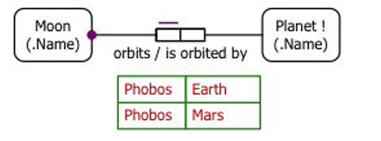

**​图 1.9 概念化基本事实和存在事实​**​

用受控自然语言表述约束 (Verbalizing Constraints) 并通过样本数据实例集说明它们，使得领域专家 (Domain Experts) 验证模型 (Validate the Model) 变得容易得多。如果某个约束仍然存疑，一个好的双重检查方法是提供一个**反例 (Counterexample)**（一个违反约束的示例）并询问这类情况是否可能。

图 1.10 显示了一个数据实例集，其中一颗卫星环绕两颗行星，从而为约束 “每颗卫星至多环绕一颗行星” 提供了一个反例。如果领域专家说这类情况不可能发生，那么该约束就得到确认。当然，如果领域专家确认这类情况可能发生，那么该约束就是错误的，应该被移除（例如，假设论域扩展到包括太阳系外行星，并且发现一颗确实环绕不止一颗行星的卫星）。

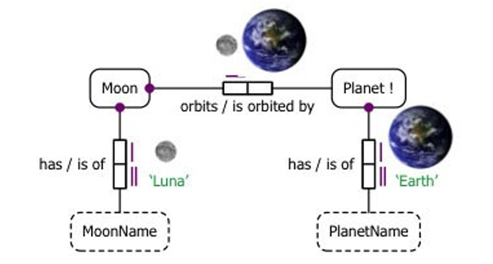

 ​**​图 1.10 一个具有违反唯一性约束的反例的 ORM 模型​**​

将所有事实建模为事实类型的实例，能够通过填充事实表以简单、统一的方式提供满足的示例和反例 (Counterexamples)。对于基于属性的结构来说，这样做要麻烦得多。表述也自然得多，特别是在 ORM 中，因为 ORM 支持**混合中缀谓词 (Mixfix Predicates)**（任何元数的）。

- 混合中缀谓词表述 (Mixfix Predicate Readings) 允许它们的对象占位符混合放置在任意位置。
- 例如，三元事实类型 `国家出口产品到国家 (Country exports Product to Country)` 使用混合中缀谓词表述 “… exports … to …”。
- 除了允许更自然的表达，并且支持一元和 n 元事实之外，混合中缀谓词 (Mixfix Predicates) 还能处理任何自然语言的句子。
  - 在英语中，二元事实通常使用**中缀谓词 (Infix Predicate)** (Infix Predicates) 表达，符合主语-动词-宾语结构（Subject-Verb-Object Structure）（例如，句子 “Luna orbits Earth” 使用中缀谓词表述 “… orbits …”）。
  - 然而，日语句子通常使用主语-宾语-动词结构（Subject-Object-Verb Structure）。例如，我们的月球环绕地球的事实在日语中表述为 “Tsuki wa chikyū o shūkai suru”，它使用了混合中缀谓词表述 “… wa … o shūkai suru”。这里，Tsuki（月球[5]）是主语 (Subject)，chikyū（地球）是语法宾语 (Grammatical Object)，shūkai suru”（goes around, does）是动词 (Verb)，而 wa 和 o 是附加到句子主题（这里的主语）和语法宾语上的**助词 (Particles)** (Particles)。

ORM **极具表现力的图形符号 (Richly Expressive Graphical Notation)** 使建模者能够轻松地可视化复杂约束（例如**排斥对约束 (Pair-Exclusion Constraints)** (Pair-Exclusion Constraints)、**外部频率约束 (External Frequency Constraints)** (External Frequency Constraints)、**环约束 (Ring Constraints)** (Ring Constraints)），这些约束无法在工业版 ER 的图形符号或 UML 类图 (Class Diagrams) 中捕获。其无属性的本质也通过明确显示对象类型如何承载角色 (Host Roles)，更好地揭示了语义连接 (Semantic Connections)。

### 概念模式设计流程 The Conceptual Schema Design Procedure

 好的，这是您提供的关于 ORM 概念模式设计流程 (CSDP) 文本的中文翻译，并对其中的关键术语添加了括号英文注释：

**对象角色建模 (Object-Role Modeling, ORM)** 中用于设计一个足够小、便于作为单一单元管理的**概念模式 (Conceptual Schema)** 的流程，称为**概念模式设计流程 (Conceptual Schema Design Procedure, CSDP)**。对于较大的信息系统，首先将业务领域 (Business Domain) 划分为更小的（可能重叠的）、便于管理的**子区域 (Subareas)**。然后对这些子区域进行**优先级排序 (Prioritized)**，以确定它们的设计顺序，并对每个子区域应用 CSDP。接着将这些**子模式 (Subschemas)** **合并 (Merged)** 或**集成 (Integrated)**，生成覆盖整个业务领域的**全局概念模式 (Global Conceptual Schema)**——在实践中，这种集成通常是**迭代进行的 (Iteratively Performed)**。在本书中，我们所有的示例都足够小，可以直接设计，无需应用初始的**自顶向下划分 (Top-Down Division)** 和最终的集成阶段。

CSDP 本身包含七个主要步骤，如表 1.2 所示。第一个主要步骤（步骤 1）是迄今为止最关键的，它被分为两个子步骤（步骤 1a 和步骤 1b）。在实践中，所有七个步骤通常是在与领域专家讨论模型的每个组成部分时执行，而不是在所有组成部分上执行完同一个步骤后再进行下一步。
 ​**​表 1.2 ORM 的概念模式设计流程 (CSDP)​**

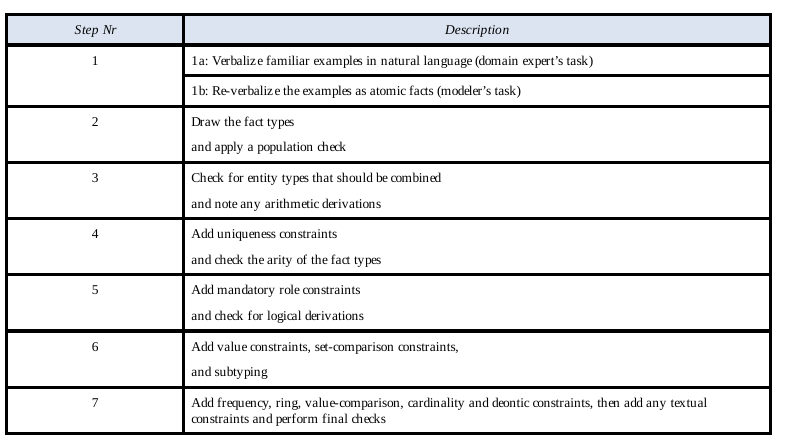

| 步骤编号 (Step Nr) | 描述 (Description)                                           |
| :----------------- | :----------------------------------------------------------- |
| 1                  | **1a:** 用自然语言表述熟悉的示例（领域专家的任务）(Verbalize familiar examples in natural language (domain expert’s task))   **1b:** 将示例重新表述为原子事实（建模者的任务）(Re-verbalize the examples as atomic facts (modeler’s task)) |
| 2                  | 绘制事实类型并进行数据实例集检查 (Draw the fact types and apply a population check) |
| 3                  | 检查应合并的实体类型并注意任何算术派生 (Check for entity types that should be combined and note any arithmetic derivations) |
| 4                  | 添加唯一性约束并检查事实类型的元数 (Add uniqueness constraints and check the arity of the fact types) |
| 5                  | 添加强制角色约束并检查逻辑派生 (Add mandatory role constraints and check for logical derivations) |
| 6                  | 添加值约束、集合比较约束和子类型化 (Add value constraints, set-comparison constraints, and subtyping) |
| 7                  | 添加频率约束、环约束、值比较约束、基数约束和道义约束，然后添加任何文本约束并进行最终检查 (Add frequency, ring, value-comparison, cardinality and deontic constraints, then add any textual constraints and perform final checks) |

在开发**过程模型 (Process Model)** 时，从所需流程的典型**用例 (Use Cases)** 开始会有所帮助。然而，在开发**数据模型 (Data Model)** 时，我们应当从对**数据需求 (Data Requirements)** 的清晰理解开始。正如夏洛克·福尔摩斯 (Sherlock Holmes) 所正确强调的，“数据！数据！数据！没有黏土我做不了砖”[6]。因此，ORM 的 CSDP 使用**数据用例 (Data Use Cases)**（所需数据被使用的案例）作为数据建模流程的种子。这些用例可以采用**样本输出报告 (Sample Output Reports)**、**样本输入表单 (Sample Input Forms)** 或信息系统需要支持的**样本查询 (Sample Queries)** 的形式。有时，这类数据用例是现成的（例如，在自动化基于纸张的信息系统或重构自动化信息系统时）。否则，我们作为建模者 (Modelers) 应与领域专家 (Domain Experts) 合作，生成此类示例作为 CSDP 步骤 1 的输入。

由于数据用例存在于**外部层 (External Level)**，它们可能有多种形式。表格提供了一种常见的输出报告类型。前面考虑的行星-卫星表是一个简单的例子，我们现在将使用表 1.3 所示的较短摘录来更好地说明 CSDP 步骤 1 在实践中如何运作。

 ​**​表 1.3 一份关于我们太阳系行星及其卫星的样本报告摘录​**

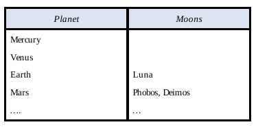

| 行星 (Planet)  | 卫星 (Moons)                     |
| :------------- | :------------------------------- |
| 水星 (Mercury) |                                  |
| 金星 (Venus)   |                                  |
| 地球 (Earth)   | 月球 (Luna)                      |
| 火星 (Mars)    | 火卫一 (Phobos), 火卫二 (Deimos) |
| …              | …                                |

如果我们已经熟悉这些数据，我们可以同时担任领域专家和建模者。然而，如果我们（作为建模者）不熟悉业务领域，我们将需要一位独立的领域专家来澄清数据的含义。简而言之，建模通常是建模者和领域专家之间的**协作过程 (Collaborative Process)**。

在 CSDP 步骤 1a 中，我们要求领域专家用自然语言表述样本信息。例如，在步骤 1a 中，假设领域专家将信息表述为以下三个句子：
 S1 水星 (Mercury)、金星 (Venus)、地球 (Earth) 和火星 (Mars) 是行星 (planets)。
 S2 地球 (Earth) 有卫星月球 (Luna)。
 S3 火卫一 (Phobos) 和火卫二 (Deimos) 是火星 (Mars) 的卫星。

在 CSDP 步骤 1b 中，我们根据需要细化领域专家的表述，以确保所有事实都是**原子事实 (Atomic Facts)**（基本事实或存在事实），并且所有对象都得到**正确识别 (Properly Identified)**。句子 S1 是**合取的 (Conjunctive)**，不是原子的，因为我们可以将其重新表述为以下四个事实而不会丢失信息：水星 (Mercury) 是一颗行星；金星 (Venus) 是一颗行星；地球 (Earth) 是一颗行星；火星 (Mars) 是一颗行星。因此，我们现在只关注其中一个较小的事实句子，例如“水星 (Mercury) 是一颗行星”。如果我们把“水星 (Mercury)”视为一个只能用于识别行星的**个体常量 (Individual Constant)**，这是有意义的。然而，在开发计算机化信息系统时，个体常量通常不适合用于识别实体。例如，假设我们扩展模型以包括行星和卫星的化学成分，现在添加事实“水星 (Mercury) 是一种元素 (element)”。这是行不通的，因为个体对象水星 (Mercury) 不可能既是一颗行星又是一种元素。

在日常话语中，我们通常通过**上下文相关的个体常量 (Contextual, Individual Constants)** 来识别对象，但这通常依赖于听众利用他们对上下文的背景知识来确定所指对象。在不同的上下文中，句子“金星 (Venus) 很漂亮 (pretty)”可能指代一颗行星、一位女神或某个特定的女人。与人类不同，通常不能依赖计算机来确定相关上下文，因此我们需要一种更精确的方式来让计算机知道我们指的是什么。

出于这些原因，最好通过**确定性描述 (Definite Descriptions)** 来识别实体，这些描述指明了实体类型以及它如何与用于引用它的一个或多个其他对象相关联。例如，确定性描述“名为‘水星 (Mercury)’的行星 (Planet)”指明了实体类型 (行星 Planet) 和一个命名关系，将实体与一个领域值（行星名称 “Mercury”）关联起来。确定性描述“名为‘水星 (Mercury)’的元素 (Element)”显然涉及不同的实体类型（元素 Element）。

如果我们问领域专家“水星 (Mercury)”对于行星来说是什么类型的标签（例如名称或代码），他或她会回答说这是行星的名称。因此，我们现在将行星列中第一个条目所传达的信息重新表述为存在事实 F1：“存在一颗名为‘水星 (Mercury)’的行星 (There exists a Planet named ‘Mercury’)”。如果我们包含对存在关系的约束（参见前面），我们可以将受约束的存在事实表述为“名为‘水星 (Mercury)’的行星存在 (The Planet named ‘Mercury’ exists)”。

领域专家将表格第三行的信息表述为句子 S2（“地球 (Earth) 有卫星月球 (Luna)”）。虽然这是原子事实，但需要一些细化。首先，我们使用确定性描述重新表述实体项如下，以包含实体类型和引用关系的性质：“名为‘地球 (Earth)’的行星 (The Planet named ‘Earth’)”；“名为‘月球 (Luna)’的卫星 (the Moon named ‘Luna’)”。最后，我们使用信息更丰富的谓词表述“被...环绕 (is orbited by)”来重新表述动词“有 (has)”，如下所示。虽然动词“有 (has)”对于存在事实通常是合理的，但对于基本事实，通常最好提供信息更丰富的表述。
 F2 名为‘地球 (Earth)’的行星被名为‘月球 (Luna)’的卫星环绕 (The Planet named ‘Earth’ is orbited by the Moon named ‘Luna’)。

对于像 F2 这样的二元事实，提供两个方向的表述通常很有用，因为这可以导致对相关约束（或缺乏约束）进行更优雅的表述。事实 F2 可以按相反方向表述如下：
 F2 名为‘月球 (Luna)’的卫星环绕名为‘地球 (Earth)’的行星 (The Moon named ‘Luna’ orbits the Planet named ‘Earth’)。

如前所述，一个基本事实 (Elementary Fact) 意味着其对象的存在，因此现在无需明确表述存在事实：存在一颗名为‘月球 (Luna)’的卫星。

领域专家将表格第四行的信息表述为句子 S3（“火卫一 (Phobos) 和火卫二 (Deimos) 是火星 (Mars) 的卫星。”）。这可以重新表述为两个原子事实的合取：名为‘火卫一 (Phobos)’的卫星环绕名为‘火星 (Mars)’的行星 (The Moon named ‘Phobos’ orbits the Planet named ‘Mars’)；名为‘火卫二 (Deimos)’的卫星环绕名为‘火星 (Mars)’的行星 (The Moon named ‘Deimos’ orbits the Planet named ‘Mars’)。

表 1.3 所示样本报告中的所有数据都可以用讨论过的原子事实来表述。从这些事实实例抽象到它们的事实类型，我们得到了前一节讨论的两个存在事实类型和一个基本事实类型。基本事实类型的两种表述可以使用正向和反向谓词表述之间的斜杠紧凑地列出，如下所示：卫星环绕 / 被行星环绕 (Moon orbits / is orbited by Planet)。

在 CSDP 步骤 2 中，我们绘制事实类型并检查它们是否可以用样本数据填充，如图 1.11(a) 所示。如前一节所述，我们通常通过在括号中列出其**引用模式 (Reference Modes)** 来缩写实体类型的引用方案。

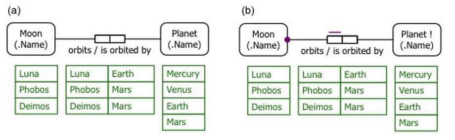

 ​**​图 1.11 (a) 绘制、填充和 (b) 约束一个 ORM 模型​**​

CSDP 步骤 3 与此示例无关，因此此处不讨论。在 CSDP 步骤 4 和 5 中，我们添加**唯一性约束 (Uniqueness Constraints)** 和**强制角色约束 (Mandatory Role Constraints)**，并将行星 (Planet) 标记为**独立的 (Independent)**，如前所述，从而得到图 1.11(b)。

如前一节所述，通过与领域专家的**表述 (Verbalization)** 和**数据实例集 (Population)** 来验证约束。CSDP 步骤 6 和 7 与此示例无关，因此我们现在得到了 ORM 模型的最终版本。此处未讨论的 CSDP 步骤将在后续章节中介绍。

### 基于事实的建模工具 Fact-Based Modeling Tools 

好的，这是您提供的关于事实建模方法历史和工具介绍文本的中文翻译，并对其中的关键术语添加了括号英文注释：

**事实建模方法 (Fact-Based Modeling Approach)** 起源于 1970 年代的欧洲，由 Eckhard Falkenberg、Sjir Nijssen、Robert Meersman 等人做出了开创性工作 (Pioneering Work)。在 1980 年代后期，当我在昆士兰大学 (The University of Queensland) 与 Eckhard 和 Sjir 一起任教时，我完成了一项**博士学位 (PhD)** 研究，形式化并扩展了他们的**自然信息分析方法 (Natural Information Analysis Method, NIAM)**。在随后的几年里，我修订并扩展了该方法，将其发展为**对象角色建模 (Object-Role Modeling, ORM)**。最近，其他人加入了我，进一步将 ORM 扩展为**第二代 ORM (second generation ORM, ORM2)**，这也是本书所讨论的 ORM 版本。

多年来，许多人共同推动了事实建模方法的发展，此处篇幅有限，无法一一列举他们的个人贡献。关于事实建模方法发展的更多历史细节，请参见 Halpin & Morgan (2008, pp. 106-108)。本书引用的参考文献的详细信息包含在书末的**进一步资源 (Further Resources)** 部分。

多年来，已经开发了许多**软件工具 (Software Tools)** 来支持不同风格的事实建模方法。

- 一个早期的先驱是**RIDL***工具 (RIDL* tool)，它由布鲁塞尔自由大学 (Free University of Brussels) 的一个 Control Data 实验室开发。该工具支持使用**参考和构想语言 (Reference and IDea Language, RIDL)** 来设计和查询 NIAM 模型，但现已停止使用 (Discontinued)。
- Sjir Nijssen 后来将 NIAM 扩展为**认知增强的 NIAM (Cognition enhanced NIAM, CogNIAM)**，目前由 **DocTool** 提供支持。
- 当前专门为**本体建模 (Ontological Modeling)** 设计的**二元关系建模工具 (Binary Relationship Modeling Tools)** 包括 **Dogma Studio** 和 **Collibra**。
- 支持 **FCO-IM 方法 (FCO-IM Approach)** 的工具包括 **CaseTalk** 和 **Infagon**。

早期的 ORM 工具包括 **InfoDesigner**、**InfoModeler**、**ActiveQuery**（一个 ORM 查询工具）、**VisioModeler** 和 **Microsoft Visio for Enterprise Architects**，但这些工具已不再受支持 (No Longer Supported)。

当前的 ORM 工具包括：

- **自然 ORM 架构师 (Natural ORM Architect, NORMA)**
- **ORM-Lite**
- **ActiveFacts**

仅用于绘图目的，有一个免费的 **ORM2 模具 (ORM2 Stencil)** 可用于 Microsoft Visio——本书前面展示的 ORM 图就是使用此模具绘制的。

关于当前可用的事实建模工具的更多详细信息在**进一步资源 (Further Resources)** 部分提供。在本书中，我们的软件工具讨论集中在 **NORMA 工具 (NORMA Tool)** 的**公共领域 (Public Domain)**、**开源版本 (Open Source Version)**。这是一个免费的 **Microsoft Visual Studio 插件 (Plug-in to Microsoft Visual Studio)**，可以从 SourceForge 下载：。它适用于从 2005 版开始的任何 Visual Studio 版本，包括免费的 **Visual Studio 2013 社区版 (Community Edition of Visual Studio 2013)** ()。

本书的每一章都以一个 **NORMA 实验 (NORMA Lab)** 结束，提供应用本章讨论的概念和技术的实践经验。

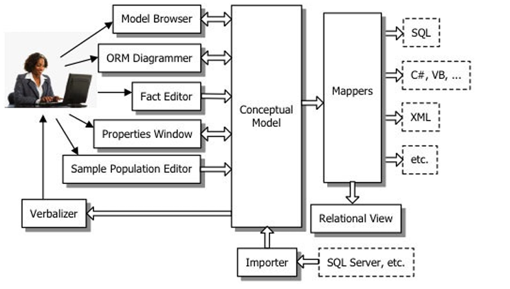

**图 1.12 NORMA 工具的主要组件**
 图 1.12 展示了 NORMA 工具主要组件的概览。

- 可以使用**事实编辑器 (Fact Editor)** 以文本方式输入**事实类型 (Fact Types)**，NORMA 会自动以图形格式显示它们。
- 您也可以通过从 **ORM 图表编辑器 (ORM Diagrammer)** 中的**工具箱 (Toolbox)** 拖拽形状，直接在图形格式中输入事实类型。
- **约束 (Constraints)** 和**规则 (Rules)** 通常使用图表编辑器、**模型浏览器 (Model Browser)** 或**属性窗口 (Properties Window)** 输入。
- **样本数据实例集 (Sample Populations)** 使用**样本数据实例集编辑器 (Sample Population Editor)** 输入。

NORMA 会自动**表述 (Verbalizes)** ORM 模型中被选中的任何部分，并能自动将 ORM 模型**映射 (Map)** 到各种用于实现的目标。

- NORMA 的**关系视图功能 (Relational View Facility)** 将 **ORM 模式 (ORM Schemas)** 映射到**关系数据库模式 (Relational Database Schemas)**，并以图形格式显示它们。
- 然后，这些**逻辑层 (Logical Level)** 的关系模式可以通过在支持的 **SQL 数据库系统 (SQL Database System)**（例如 SQL Server、DB2 或 Oracle）中生成 **SQL 代码 (SQL Code)** 来映射到**物理层 (Physical Level)**。
- 本书中的 NORMA 实验提供了关于如何输入 ORM 模型、生成**关系模式图 (Relational Schema Diagrams)** 和 SQL 代码的详细信息。

尽管本书未涵盖，NORMA 也可以将 ORM 模型映射到其他目标，例如**可扩展标记语言 (eXtensible Markup Language, XML)** 和**编程语言 (Programming Languages)** 如 C# 和 Visual Basic，并可用于将现有的 SQL 数据库模式**逆向工程 (Reverse Engineer)** 为 ORM 模式。

在撰写本文时，一个功能更强大的 **NORMA 专业版 (Professional Version of NORMA)** 正在开发中，它支持**形式化输入派生规则 (Formal Entry of Derivation Rules)**、**多页关系视图 (Multi-page Relational Views)** 和其他高级功能。由于此版本目前尚不可用，我们将注意力集中在免费的公共领域版本的 NORMA 上。

### NORMA 实验一 NORMA Lab 1 


## 概念模式设计流程步骤 1-5 CSDP Steps 1–5 

好的，这是您提供的关于 ORM 概念模式设计流程 (CSDP) 前五个步骤文本的中文翻译，并对其中的关键术语添加了括号英文注释：

如前一章所述，**对象角色建模 (Object-Role Modeling, ORM)** 的**概念模式设计流程 (Conceptual Schema Design Procedure, CSDP)** 包含七个主要步骤。本章我们将介绍前五个步骤，总结如表 2.1 所示。前一章中**月球-行星模型 (moon-planets model)** 的设计涉及 CSDP 步骤 1、2、4 和 5 的一个非常简单的应用。在那个模型中，所有**事实类型 (fact types)** 都是**断言型二元事实类型 (asserted, binary fact types)**，所有**实体类型 (entity types)** 都有一个**简单引用模式 (simple reference scheme)**，并且唯一的**约束 (constraints)** 是**简单唯一性约束 (simple uniqueness constraints)** 和**简单强制角色约束 (simple mandatory role constraints)**。本章将扩展我们对 ORM 的覆盖范围，包括：

- **一元事实类型 (unary fact types)** 和 **n元事实类型 (n-ary fact types)**
- **派生事实类型 (derived fact types)**
- **外部唯一性约束 (external uniqueness constraints)**
- **析取强制角色约束 (disjunctive mandatory role constraints)**（也称为**包含或约束 (inclusive-or constraints)**）
- **复合标识实体类型 (compositely identified entity types)**
- **对象化 (objectification)**

**表 2.1 ORM 概念模式设计流程 (CSDP) 的步骤 1–5**

| 步骤编号 (Step Nr) | 描述 (Description)                                           |
| :----------------- | :----------------------------------------------------------- |
| 1                  | **1a:** 用自然语言表述熟悉的示例（领域专家的任务）(Verbalize familiar examples in natural language (domain expert’s task))   **1b:** 将示例重新表述为原子事实（建模者的任务）(Re-verbalize the examples as atomic facts (modeler’s task)) |
| 2                  | 绘制事实类型并进行数据实例集检查 (Draw the fact types and apply a population check) |
| 3                  | 检查应合并的实体类型并注意任何算术派生 (Check for entity types that should be combined and note any arithmetic derivations) |
| 4                  | 添加唯一性约束并检查事实类型的元数 (Add uniqueness constraints and check the arity of the fact types) |
| 5                  | 添加强制角色约束并检查逻辑派生 (Add mandatory role constraints and check for logical derivations) |

### 概念模式设计流程步骤 1-3 CSDP Steps 1–3 

**CSDP 步骤 1–3**

在 **CSDP 步骤 1 (CSDP Step 1)** 中，我们用**原子事实 (Atomic Facts)** 的术语来表述所需信息的示例。

- 为了确保样本数据背后的正确语义被揭示出来，理解数据的人（**领域专家 (Domain Expert)**）应该执行初始表述，至少是非正式的（CSDP 步骤 1a）。
- 作为**建模者 (Modelers)**，我们随后根据需要细化表述，以确保信息被捕获为原子事实（**基本事实 (Elementary Facts)** 或**存在事实 (Existential Facts)**），并且实体通过**引用方案 (Reference Scheme)** 得到正确识别（CSDP 步骤 1b）。

信息样本可以以多种方式呈现。对于前一章讨论的月球-行星模型，示例数据以**表格报告 (Tabular Report)** 的形式呈现。其他常见的数据呈现方式包括**表单 (Forms)**、**图表 (Graphs)** 和**示意图 (Diagrams)**。图 2.1 显示了一个大学员工记录表单的三个简化示例。为了练习 CSDP 步骤 1，请尝试在继续阅读之前，自己表述这些表单所传达的信息。
 ​**​图 2.1 三个员工记录表单的简化示例​**​

左侧表单的第一个条目可以表述为无约束的存在事实：**存在一个员工编号 (EmployeeNr) 为 1001 的员工 (Employee) (There exists an Employee who has the EmployeeNr 1001)**。在实践中，“编号 (Number)”在标签中常缩写为“Nr”、“No”或“#”。表单本身并未告诉我们员工编号指的是员工，但我们对这类表单的熟悉程度使我们能够利用背景知识提取这些语义。该表述并未说明员工编号是**标识性的 (Identifying)**，但我们可以通过询问领域专家“每个员工是否都有一个员工编号？”以及“每个员工编号是否只指代一个员工？”来确认这一点。假设领域专家对这两个问题都回答“是”，我们现在可以断言受约束的存在事实：**员工编号为 1001 的员工存在 (The Employee who has the EmployeeNr 1001 exists)**，并且我们可以使用确定性描述“员工编号为 1001 的员工 (The Employee who has the EmployeeNr 1001)”（或更简洁地说“员工编号为 1001 的员工 (The Employee with EmployeeNr 1001)”）来识别该员工，其他员工也类似处理。

向下移动到左侧表单上选中的**单选按钮 (Radio Button)**，我们可以将该选择表述为一元事实：**员工编号为 1001 的员工是女性 (The Employee with EmployeeNr 1001 is female)**。同样，表单本身并未告诉我们这些语义。相反，我们利用背景知识在 1001 条目和单选按钮选择之间建立适当的联系。类似地，我们可以将中间表单的单选按钮选择表述为：**员工编号为 1002 的员工是男性 (The Employee with EmployeeNr 1002 is male)**。

虽然这些一元事实表述是正确的，但我们可以将信息重新表述为以下二元事实：**员工编号为 1001 的员工具有名称为‘女性 (female)’的性别 (Gender) (The Employee with EmployeeNr 1001 has the Gender with GenderName ‘female’)**；**员工编号为 1002 的员工具有名称为‘男性 (male)’的性别 (The Employee with EmployeeNr 1002 has the Gender with GenderName ‘male’)**。正如 Halpin & Morgan (2008) 所讨论的，ORM 包含用于在各种等效建模替代方案之间进行选择的**概念模式优化启发式规则 (Conceptual Schema Optimization Heuristics)**。其中一个启发式规则建议将一组**互斥的一元事实类型 (Mutually Exclusive Unary Fact Types)**（例如 `员工是女性 (Employee is female)`；`员工是男性 (Employee is male)`）重塑为一个单一的二元事实类型（例如 `员工具有性别 (Employee has Gender)`）。在实践中，使用短代码（例如 ‘M’, ‘F’）而不是名称（例如 ‘Male’, ‘Female’）作为性别 (Gender) 等实体的**首选标识符 (Preferred Identifiers)** 通常也更高效。因此，我们同意将讨论的两个单选按钮选择表述如下：**员工编号为 1001 的员工具有代码为‘F’的性别 (The Employee with EmployeeNr 1001 has the Gender with GenderCode ‘F’)**；**员工编号为 1002 的员工具有代码为‘M’的性别 (The Employee with EmployeeNr 1002 has the Gender with GenderCode ‘M’)**。

使用**引用模式 (Reference Modes)**，三个表单上单选按钮选择传达的基本事实可以在 FORML 中更紧凑地列出如下：

```
Employee(.Nr) 1001 has Gender(.Code) 'F'.
Employee(.Nr) 1002 has Gender(.Code) 'M'.
Employee(.Nr) 1003 has Gender(.Code) 'M'.
```

这些事实都是以下事实类型的实例：

```
Employee(.Nr) has Gender(.Code).
```

注意 `.Nr` 和 `.Code` 中的点“.”。这标志着引用模式是**常用引用模式 (Popular Reference Modes)**，使得底层的**引用事实类型 (Reference Fact Types)**（例如 `员工有/属于员工编号 (Employee has/is of EmployeeNr)`，`性别有/属于性别代码 (Gender has/is of GenderCode)`）可以通过将引用模式名称附加到实体类型名称来确定相关值类型的名称。

在 **CSDP 步骤 2 (CSDP Step 2)** 中，我们绘制并填充事实类型。其 Visio 呈现如图 2.2 所示。如果您在 NORMA 的**事实编辑器 (Fact Editor)** 中输入上述事实类型表述，模式图将自动为您绘制，并且您可以在**样本数据实例集编辑器 (Sample Population Editor)** 中添加示例数据。
 ​**​图 2.2 ORM 图：(a) 紧凑、填充形式，和 (b) 展开形式​**​
 在此阶段，我们尚未向 `员工具有性别 (Employee has Gender)` 事实类型添加​**​强制角色约束 (Mandatory Role Constraints)​**​ 和​**​唯一性约束 (Uniqueness Constraints)​**​。我们也没有在 `性别代码 (GenderCode)` 上添加​**​值约束 (Value Constraint)​**​ 来将其可能值限制为 ‘M’ 和 ‘F’。这将在我们稍后讨论的 CSDP 步骤 4–6 中完成；但在实践中，在继续处理下一个事实类型之前完成这些步骤也是正常的。如果需要，您也可以通过添加​**​单射事实类型 (Injective Fact Type)​**​ `性别有性别名称 (Gender has GenderName)` 将性别名称（‘女性 (female)’, ‘男性 (male)’）包含在模型中，但在我们的解决方案中将忽略这一点。

图 2.1 中员工表单的下两个字段用于记录每个员工的**姓氏 (Family Name)** 和**名字 (Given Name)**。例如，左侧表单上员工编号和姓名条目之间的联系可以表述如下：**员工编号为 1001 的员工姓氏为‘Jones’ (The Employee with EmployeeNr 1001 has FamilyName ‘Jones’)**；**员工编号为 1001 的员工名字为‘Amanda’ (The Employee with EmployeeNr 1001 has GivenName ‘Amanda’)**。这些实例的事实类型可以在 FORML 中紧凑地列出，如下所示：

```
Employee(.Nr) has FamilyName().
Employee(.Nr) has GivenName().
```

将空括号“()”附加到对象类型名称表示该对象类型是**领域值类型 (Domain Value Type)**。与实体不同，领域值（例如姓氏 ‘Jones’）是**自标识的 (Self-identifying)**，因此可以直接引用它们，而无需将它们与另一个领域对象相关联以进行标识。FORML 在声明值类型时使用空括号表示它们不需要额外的引用方案。

如果您之前已经输入了 `Employee(.Nr) has Gender(.Code)` 事实类型，那么 `员工 (Employee)` 和 `性别 (Gender)` 的引用方案已经声明，因此在 NORMA 的事实编辑器中输入姓氏和名字事实类型时，可以省略 `员工 (Employee)` 的引用模式。因此，这些事实类型现在可以简单地输入为：`员工有姓氏 () (Employee has FamilyName())`；`员工有名字 () (Employee has GivenName())`。

有时，一个实体类型可能有多个**候选引用方案 (Candidate Reference Schemes)**。例如，在某些业务领域中，人可以通过姓氏和名字的组合来识别，例如“Amanda Jones”、“John Smith”。如果您回顾图 2.1，很明显，这在我们当前的业务领域中并非如此，因为两个不同的员工（由员工编号 1001 和 1003 标识）具有相同的姓氏和名字组合。

图 2.1 中左侧和右侧表单上的**复选框 (Check Box)** 条目可以表述为以下一元事实：**员工编号为 1001 的员工是终身教职的 (The Employee with EmployeeNr 1001 is tenured)**；**员工编号为 1003 的员工是终身教职的 (The Employee with EmployeeNr 1003 is tenured)**。这些实例的底层事实类型可以声明如下：

```
Employee is tenured.
```

中间表单复选框中没有条目表明缺少一个事实来声明员工编号为 1003 的员工是终身教职的。如果我们为此事实类型采用**封闭世界假设 (Closed World Assumption)**（假设所有相关事实都是已知的），我们可以推断员工 1003 不是终身教职的。如果我们采用**开放世界假设 (Open World Assumption)**，我们则认为该员工是否是终身教职是未知的。我们应该与领域专家核实以确定哪种含义是预期的。

图 2.1 左侧表单的**学位 (Degrees)** 字段中的条目可以在 CSDP 步骤 1a 中非正式地表述为以下复合事实：**员工 1001 拥有文学学士 (BA) 和哲学博士 (PhD) 学位 (Employee 1001 has a BA and a PhD)**。对于 CSDP 步骤 1b，我们可以正式地将其表述为两个原子事实：**员工编号为 1001 的员工持有代码为‘BA’的学位 (Degree) (The Employee with EmployeeNr 1001 holds the Degree with DegreeCode ‘BA’)**；**员工编号为 1001 的员工持有代码为‘PhD’的学位 (The Employee with EmployeeNr 1001 holds the Degree with DegreeCode ‘PhD’)**。这些是以下事实类型的实例：

```
Employee holds Degree(.Code).
```

为了完成 CSDP 步骤 2，绘制一个填充了数据的 ORM 图，如图 2.3 所示。默认情况下，具有单一**谓词表述 (Predicate Reading)** 的事实类型从左到右阅读（或者如果谓词垂直显示则从上到下阅读）。为了反转阅读方向，添加一个箭头提示以显示阅读方向，如姓氏和名字事实类型所示。如果您使用 NORMA 工具，这些方向箭头会自动添加。
 `员工 (Employee)`、`性别 (Gender)` 和 `学位 (Degree)` 对象类型的数据实例集可以在此处省略，因为它们可以从事实类型的数据实例集中推断出来。约束将在后续步骤中添加（您可能希望尝试自己添加唯一性和强制角色约束，并检查它们是否与样本数据一致）。
 ​**​图 2.3 图 2.1 表单的 ORM 模型（约束尚未添加）​**​

现在考虑图 2.4 所示的关于航班路线的图形报告摘录。您会如何表述标有“UA508”的箭头所传达的信息？非正式地，我们可能将其表达为一个**三元事实 (Ternary Fact)**，例如“航班 UA508 从西雅图 (SEA) 飞往洛杉矶 (LAX) (Flight UA508 goes from SEA to LAX)”。但这不是一个原子事实，因为我们可以将其拆分为以下两个原子事实而不会丢失信息：**航班 UA508 起始于西雅图 (Flight UA508 starts at SEA)**；**航班 UA508 结束于洛杉矶 (Flight UA508 ends at LAX)**。正式地说，我们可以执行此拆分是因为每个航班只有一个起点和一个终点[11]。
 ​**​图 2.4 美国西部航班路线样本摘录​**​
 如果数据以表格格式呈现，如图 2.4(b) 所示，则更容易看出涉及两个原子事实类型。假设我们将第一行数据表述如下：​**​航班 UA508 有出发地 (Origin) ‘SEA’ (Flight UA508 has Origin ‘SEA’)​**​；​**​航班 US508 有目的地 (Destination) ‘SFO’ (Flight US508 has Destination ‘SFO’)​**​。将实际条目视为所涉及实体的编号或代码，我们可能会绘制如图 2.5 所示的 ORM 图，但这是错误的。为什么？
 如数据所示，一个航班的出发地也可能是某个航班的目的地（例如 SEA）。因此，`出发地 (Origin)` 和 `目的地 (Destination)` 类型​**​重叠 (Overlap)​**​（即它们有一个共同的实例）。然而，在图 2.5 中，`出发地 (Origin)` 和 `目的地 (Destination)` 被显示为​**​顶层实体类型 (Top Level Entity Types)​**​（即不是​**​子类型 (Subtypes)​**​ 的对象类型）。在 ORM 中，顶层类型被假定为​**​互斥的 (Mutually Exclusive)​**​（即没有共同的实例）。
 ​**​图 2.5 一个有缺陷的 ORM 模式​**​
 为了修复此错误，我们需要将 `出发地 (Origin)` 和 `目的地 (Destination)` 合并为一个实体类型。一般来说，如果实体类型重叠，它们必须被合并。此任务是 ​**​CSDP 步骤 3 (CSDP Step 3)​**​ 的一部分，该步骤要求我们检查应合并的实体类型。在这个特定案例中，我们确定航班出发地和航班目的地是​**​机场 (Airports)​**​，因此我们可以将模式重塑为如图 2.6 所示。
 ​**​图 2.6 将原来的出发地和目的地类型合并为机场​**​
 除了样本数据实例集之外，此图还包括 `机场 (Airport)` 所承载角色的​**​角色名称 (Role Names)​**​（‘出发地 (origin)’ 和 ‘目的地 (destination)’）。在 ORM 图上，角色名称以蓝色显示，放在相关​**​角色框 (Role Box)​**​ 旁边的方括号内。角色名称在 ORM 中是可选的，但在将 ORM 模式映射到​**​关系模式 (Relational Schema)​**​ 时，对于控制生成的列名非常有用。角色名称在指定​**​属性风格规则 (Attribute-Style Rules)​**​ 时也很有用（稍后讨论）。

即使实体类型不重叠，如果它们的实例可以有意义地进行比较（例如具有相同或兼容单位的测量值），有时将它们组合起来也很有用。

CSDP 3 的最后阶段是注意任何**算术派生 (Arithmetic Derivations)**。如果一个事实类型可以通过应用算术规则从其他事实类型派生出来，那么应该记录此**派生规则 (Derivation Rule)**，并将该事实类型标记为**派生的 (Derived)**。例如，考虑表 2.2 所示的报告摘录。某些数据可以被派生吗？
 ​**​表 2.2 关于行星及其卫星的报告摘录​**​

| 行星 (Planet)  | 卫星 (Moons)                     | 卫星数量 (Nr Moons) |
| :------------- | :------------------------------- | :------------------ |
| 水星 (Mercury) |                                  | 0                   |
| 金星 (Venus)   |                                  | 0                   |
| 地球 (Earth)   | 月球 (Luna)                      | 1                   |
| 火星 (Mars)    | 火卫一 (Phobos), 火卫二 (Deimos) | 2                   |
| …              | …                                | …                   |

您可能意识到，一颗行星的卫星数量可以通过计算围绕该行星运行的卫星数量来派生。此示例的 ORM 模式（尚未添加约束）可以设置为如图 2.7 所示。事实类型 `行星有卫星数量 (Planet has NrMoons)` 是一个派生事实类型，如其谓词表述后附加星号“*”所示。该事实类型的派生规则在图下方列出，前面加一个星号。
 ​**​图 2.7 行星有卫星数量是一个派生事实类型​**​
 默认情况下，派生事实类型的数据实例集不被存储，而是在需要时计算（例如，当查询卫星数量时）。这种“按需派生 (Derive on Query)”的方法称为​**​惰性求值 (Lazy Evaluation)​**​。

ORM 还允许您声明派生事实类型的数据实例集被存储，以便它始终立即可用。这种“更新时派生 (Derive on Update)”的方法称为**急切求值 (Eager Evaluation)**。在这种情况下，事实类型既是派生的又是**存储的 (Stored)**，并在其谓词表述后附加双星号“**”，如图 2.8 所示。
 ​**​图 2.8 行星有卫星数量是一个派生且存储的事实类型​**​

所有实例都是**简单断言的 (Simply Asserted)** 的事实类型是**断言事实类型 (Asserted Fact Type)**。例如，`卫星环绕行星 (Moon orbits Planet)` 是一个断言事实类型。在典型的 ORM 模型中，大多数事实类型是断言的。除了断言和派生事实类型外，ORM 还允许您将事实类型声明为**半派生的 (Semiderived)**，以便其某些实例可以被简单断言，而其他实例可以被派生。例如，如果 `人是人的父母 (Person is a parent of Person)` 事实类型的数据实例集不完整，那么 `人是人的祖父母 (Person is a grandparent of Person)` 的某些实例可能被简单断言，而不是从父母事实派生。半派生事实类型通过在谓词表述后附加加号上标“+”（直观上，是半个星号）来描绘。同时也是存储的半派生事实类型附加双加号上标“++”。

### 概念模式设计流程步骤 4 CSDP Step 4 

### 概念模式设计流程步骤 5 CSDP Step 5 

### 对象化 Objectification 

### NORMA 实验二 NORMA Lab 2 

## 概念模式设计流程步骤 6 CSDP Step 6 

### 值约束 Value Constraints 

### 集合比较约束 Set-Comparison Constraints 

### 子类型化 Subtyping 

### NORMA 实验三 NORMA Lab 3 

## 概念模式设计流程步骤 7 CSDP Step 7 

### 频率约束 Frequency Constraints 

### 环约束 Ring Constraints 

### 值比较约束 Value-Comparison Constraints 

### 其他约束与最终检查 Other Constraints and Final Checks 

### NORMA 实验四 NORMA Lab 4 

## 附录 A：生成 SQL 代码 Appendix A: Generating SQL Code 

## 附录 B：ORM 符号术语表 Appendix B: ORM Symbol Glossary 

## 附录 C：进一步学习资源 Appendix C: Further Resources 

## 索引 Index

[^1]: 